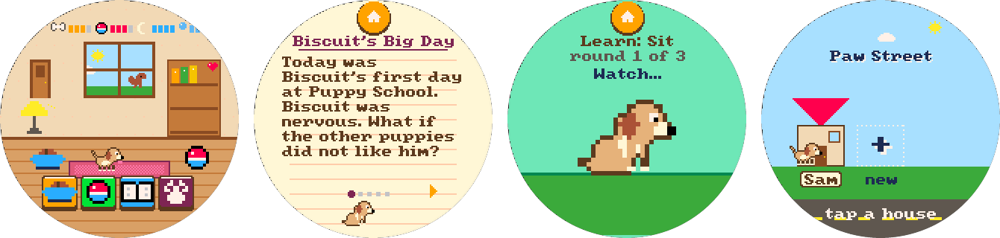

# porthole
[](https://github.com/dreamiurg/porthole/actions/workflows/ci.yml)
[](LICENSE)
[](docs/hardware.md)

> A growing collection of small apps for one round touchscreen, with a shared
> toolchain to build, test, release and flash every one of them.

The screen is the Waveshare ESP32-S3-Touch-LCD-2.1: a 2.1-inch round 480x480
touchscreen with an ESP32-S3 behind it. In a 3D-printed case it becomes a
pocket gadget with no buttons at all. Each directory under [`apps/`](apps/) is a
complete, self-contained project for that screen: a game, a toy, a tool. The
plumbing they all need lives here once: board config, build and flash commands,
tests in CI, release images, screenshots.

New apps land here as they get made. Fork it, play with them, build your own.

## Apps

| App | What it is | Runs on a computer |
| --- | --- | --- |
| [Pets Club](#pets-club) | Pixel puppy that grows over real days, learns tricks and gets read to. Up to three kids per device. | Browser emulator |
| [Biscuit](#biscuit) | Story dog with branching mysteries and 96 illustrated discoveries. | Web app |

### Pets Club

[](apps/pets-club/)

A Tamagotchi-style puppy drawn in a 32-color retro palette. It grows from puppy
to grown dog over real calendar days, learns eight tricks through three lessons
each, and loves being read to: 30 original stories across three reading levels,
matched to the kid's age. Fetch and spelling games, daily gifts, stickers and
hats keep kids coming back. Every kid gets a house on Paw Street, optionally
behind a 4-digit code, and a pup that naps after a few minutes so the next kid
gets a turn. Nothing ever dies.

C++, no libraries: a 160x160 indexed framebuffer scaled 3x, with a host
simulator, a browser emulator and scripted playtests that audit every screen
for tap-target size, bezel clipping and contrast.
**[Read more](apps/pets-club/README.md)** · try it: `make -C apps/pets-club webemu`

### Biscuit

[](apps/biscuit/)

A little dog with a big bookshelf, for strong young readers. Seven branching
mysteries with two ways to investigate each, 96 illustrated and sourced
discoveries across 12 topics, a discovery notebook, six tricks, daily
adventures and a scrapbook. Needs have a gentle floor, and days away never
cost friendship.

Plain HTML, CSS and JavaScript in the browser. The native firmware uses LVGL
and runs the same stories, pixel art and discoveries on the board.
**[Read more](apps/biscuit/README.md)** · try it: `cd apps/biscuit && npm start`

## Getting started

You need Python 3.11+, Node 22, a C++17 compiler, and PlatformIO for firmware.

```sh
git clone https://github.com/dreamiurg/porthole.git
cd porthole
pip install -r platform/requirements.txt   # PlatformIO Core + the pinned builder deps
make check                                 # lint + tests for every app
```

Flash a board over USB-C. PlatformIO finds the port when one board is plugged in.

```sh
make flash APP=pets-club
make flash APP=biscuit PORT=/dev/ttyUSB0
make monitor
```

**No toolchain?** Each release attaches `<app>-<version>-factory.bin`. Open
[esptool-js](https://espressif.github.io/esptool-js/) in Chrome or Edge,
connect the board and write the file at address `0x0`. A factory image is for a
fresh install: it also clears the app's saved progress. To update a board
without losing saves, use `make flash`.

## Make your own app

Copy the shape of an existing app into `apps/<your-app>/`. An app needs a
`Makefile` with the shared targets (`lint`, `test`, `check`, `coverage`, `ci`,
`firmware`, `flash`, `factory`), a PlatformIO project that extends the shared
board config, a README, and two screenshot strips made with
`tools/gallery.py`. The full checklist is in [docs/new-app.md](docs/new-app.md).

What you get for free:

- Board config is pinned. [`platform/waveshare-round.ini`](platform/waveshare-round.ini)
  fixes the PlatformIO platform, PSRAM and flash settings, and
  [`platform/requirements.txt`](platform/requirements.txt) pins PlatformIO itself.
- The same commands work for every app: `make check`, `make ci`,
  `make firmware APP=...` and `make flash APP=...`.
- Quality gates run early. Pre-commit hooks cover formatting, secret
  scanning, SAST, mypy and the changed app's tests. Pre-push adds the complexity
  ratchet, playtests, coverage and the firmware build. CI repeats it once per PR
  as a cheap backstop, only for the apps a PR touches.
- Releases are automatic. Each merge that adds a `feat:` or `fix:` to an app
  tags a new version of that app, publishes release notes and attaches a
  flashable factory image. See [Releases](https://github.com/dreamiurg/porthole/releases).

## Layout

```
apps/<app>/         one self-contained project per directory
platform/           shared PlatformIO base, pinned requirements, factory-image script
tools/gallery.py    README screenshot strips from panel captures
docs/               hardware.md (board, pins, round-screen rules), new-app.md (the app contract)
.github/            CI, releases, Dependabot
.claude/            agent roster and skills for AI-assisted work (see CLAUDE.md)
```

Board details, pins and round-screen design notes: [docs/hardware.md](docs/hardware.md).

## Contributing

Fixes, new stories, new apps: all welcome. Branch, run `make hooks` once, and
open a PR with a conventional-commit title. [CONTRIBUTING.md](CONTRIBUTING.md)
has the details.

## License

[MIT](LICENSE). Bundled fonts keep their own licenses: SIL OFL for Montserrat,
public domain for font8x8.
