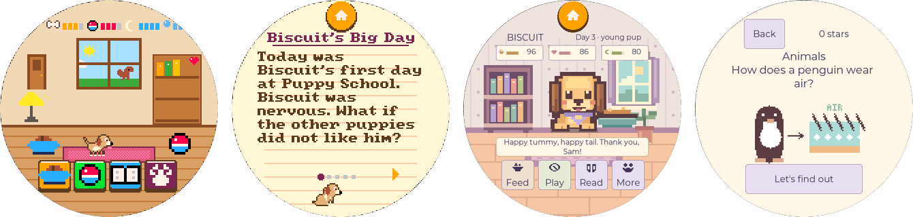
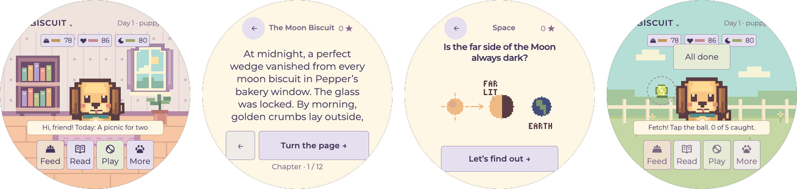

# porthole
[](https://github.com/dreamiurg/porthole/actions/workflows/ci.yml)
[](LICENSE)
[](docs/hardware.md)

> A growing collection of small apps for one round touchscreen, with a shared
> toolchain to build, test, release and flash every one of them.

The screen is the Waveshare ESP32-S3-Touch-LCD-2.1: a 2.1-inch round 480x480
touchscreen with an ESP32-S3 behind it. In a 3D-printed case it becomes a
pocket gadget with no buttons at all. Each directory under [`apps/`](apps/) is a
complete, self-contained project for that screen: a game, a toy, a tool. The
plumbing they all need lives here once: board config, build and flash commands,
tests in CI, release images, screenshots.

New apps land here as they get made. Fork it, play with them, build your own.

## How this started

It started with a small project on MakerWorld,
[ESP32 Plane Radar](https://makerworld.com/en/models/2872376-esp32-plane-radar-live-ads-b-on-a-round-display)
by [MatixYo](https://github.com/MatixYo/ESP32-Plane-Radar). A tiny ESP32 board
and a 1.28-inch round screen pull live flight data from the internet and draw
the planes overhead on a little radar. I built one with my kids, and then I
showed them how to change it with Claude Code. They asked for changes and
watched them show up on the little screen. I loved that.

So we went one step further and bought a bigger round screen, the Waveshare
board this repo is built for. In one sitting with Claude and Codex we had a
couple of games running on it. My kids loved them so much that I shared them
with friends, and their kids had a blast too. This repo is the cleaned-up home
for those games, set up so anyone can add the next one.

If you like to tinker and have $35-45 for a board, or a spare one lying in a
drawer, have fun with it. Enjoy the new era of tinkering.

## Apps

**[How to put a game on a board](https://dreamiurg.net/porthole/)**: download it from the releases and write it from Chrome, no tools needed.

| App | What it is | Runs on a computer |
| --- | --- | --- |
| [Porthole](#porthole) | The device firmware. First game inside: Pets Club, a pixel puppy that grows over real days, learns tricks and gets read to. A profile for each kid, up to four per device. | Browser emulator |
| [Biscuit](#biscuit) | Story dog with branching mysteries and 96 illustrated discoveries. | Web app |

### Porthole

[](apps/porthole/)

The firmware that turns the round screen into a games device. Its first game is
Pets Club: a Tamagotchi-style puppy drawn in a 32-color retro palette. It grows from puppy
to grown dog over real calendar days, learns eight tricks through three lessons
each, and loves being read to: 30 original stories across three reading levels,
matched to the kid's age. Fetch and spelling games, daily gifts, stickers and
hats keep kids coming back. Up to four kids get a profile each (a face, an age,
an optional 4-digit code) and their own pup and house on Paw Street; after a few
minutes of play a kid rests so the next one gets a turn. Nothing ever dies.

C++, no libraries: a 160x160 indexed framebuffer scaled 3x, with a host
simulator, a browser emulator and scripted playtests that audit every screen
for tap-target size, bezel clipping and contrast.
**[Read more](apps/porthole/README.md)** · try it: `make -C apps/porthole webemu`

### Biscuit

[](apps/biscuit/)

A little dog with a big bookshelf, for strong young readers. Seven branching
mysteries with two ways to investigate each, 96 illustrated and sourced
discoveries across 12 topics, a discovery notebook, six tricks, daily
adventures and a scrapbook. Needs have a gentle floor, and days away never
cost friendship.

Plain HTML, CSS and JavaScript in the browser. The native firmware uses LVGL
and runs the same stories, pixel art and discoveries on the board.
**[Read more](apps/biscuit/README.md)** · try it: `cd apps/biscuit && npm start`

## Get a board

Every app here runs on the **Waveshare ESP32-S3-Touch-LCD-2.1**, $35-45.

- [Amazon](https://www.amazon.com/dp/B0DDPQSKJD?tag=dreamiurg-20): about $45, usually the fastest shipping. This is an affiliate link.
- [Waveshare](https://www.waveshare.com/esp32-s3-touch-lcd-2.1.htm): about $35, the maker's own store. No affiliate link.

If you buy through the Amazon link, I get a small commission and you pay the
same price. As an Amazon Associate I earn from qualifying purchases.

Get the exact 2.1-inch model. Waveshare sells look-alike round boards in other
sizes (1.28, 1.85 and 2.8 inch), and those won't run these apps. The 2.1-inch
board comes in two versions: the flat touch panel (`ESP32-S3-Touch-LCD-2.1`)
and a curved 2.5D glass one (`ESP32-S3-Touch-LCD-2.1B`). We use the flat one
because it looked easier to work with. We haven't tried the curved one.

### Other boards

Right now the apps support one board: the flat 2.1-inch
`ESP32-S3-Touch-LCD-2.1`, the one on my desk. I'm not planning to port them to
other hardware myself. This is a fun side project, so hack away. We live in the
era of AI agents: fork the repo, point Claude Code or Codex at
[docs/hardware.md](docs/hardware.md) and the app you like, and ask it to adapt
the code to your board. Most of the hardware-specific code sits in
`apps/porthole/firmware/board.cpp`, `apps/biscuit/firmware/src/board.cpp` and the
shared PlatformIO settings in `platform/waveshare-round.ini`. A screen of a
different size or shape also means reworking the layouts, since both games are
drawn for a 480x480 circle. If you get another board working, send a
pull request. If you get stuck, open an issue and ask.

Why this board works well for toys like these:

- The round screen feels like a toy, not a tiny phone.
- Touch is the only input, so it fits a 3D-printed case with no buttons.
- It has enough memory to double-buffer the full 480x480 screen, so animation stays smooth.
- A real-time clock keeps time while it's off, which suits anything with days and nights.
- Plain Arduino and PlatformIO work, and one USB-C cable handles power, flashing and the serial console.

It also has a motion sensor, Bluetooth and Wi-Fi that no app uses yet.
[docs/hardware.md](docs/hardware.md) has the full specs and some ideas for them.

## Getting started

You need Python 3.11+, Node 22, a C++17 compiler, and PlatformIO for firmware.

```sh
git clone https://github.com/dreamiurg/porthole.git
cd porthole
pip install -r platform/requirements.txt   # PlatformIO Core + the pinned builder deps
make check                                 # lint + tests for every app
```

Flash a board over USB-C. PlatformIO finds the port when one board is plugged in.

```sh
make flash APP=porthole
make flash APP=biscuit PORT=/dev/ttyUSB0
make monitor
```

### Install from the browser

The easiest way needs no tools at all: download `<app>-<version>-factory.bin` from the
[releases](https://github.com/dreamiurg/porthole/releases), plug the board in over USB-C, open
[esptool-js](https://espressif.github.io/esptool-js/) in Chrome or Edge, and write the file at
address `0x0`. This erases the board, saved progress included. Step by step, with pictures of the
games: [dreamiurg.net/porthole](https://dreamiurg.net/porthole/).

## Make your own app

Copy the shape of an existing app into `apps/<your-app>/`. An app needs a
`Makefile` with the shared targets (`lint`, `test`, `check`, `coverage`, `ci`,
`firmware`, `flash`, `factory`), a PlatformIO project that extends the shared
board config, a README, and two screenshot strips made with
`tools/gallery.py`. The full checklist is in [docs/new-app.md](docs/new-app.md).

What you get for free:

- Board config is pinned. [`platform/waveshare-round.ini`](platform/waveshare-round.ini)
  fixes the PlatformIO platform, PSRAM and flash settings, and
  [`platform/requirements.txt`](platform/requirements.txt) pins PlatformIO itself.
- The same commands work for every app: `make check`, `make ci`,
  `make firmware APP=...` and `make flash APP=...`.
- Quality gates run early. Pre-commit hooks cover formatting, secret
  scanning, SAST, mypy and the changed app's tests. Pre-push adds the complexity
  ratchet, playtests, coverage and the firmware build. CI repeats it once per PR
  as a cheap backstop, only for the apps a PR touches.
- Releases are automatic. Each merge that adds a `feat:` or `fix:` to an app
  tags a new version of that app, publishes release notes and attaches a
  flashable factory image. See [Releases](https://github.com/dreamiurg/porthole/releases).

## Layout

```
apps/<app>/         one self-contained project per directory
platform/           shared PlatformIO base, pinned requirements, factory-image script
tools/gallery.py    README screenshot strips from panel captures
docs/               hardware.md (board, pins, round-screen rules), new-app.md (the app contract)
.github/            CI, releases, Dependabot
.claude/            agent roster and skills for AI-assisted work (see CLAUDE.md)
```

Board details, pins and round-screen design notes: [docs/hardware.md](docs/hardware.md).

## Contributing

Fixes, new stories, new apps: all welcome. Branch, run `make hooks` once, and
open a PR with a conventional-commit title. [CONTRIBUTING.md](CONTRIBUTING.md)
has the details.

## License

[MIT](LICENSE). Bundled fonts keep their own licenses: SIL OFL for Montserrat,
public domain for font8x8.
