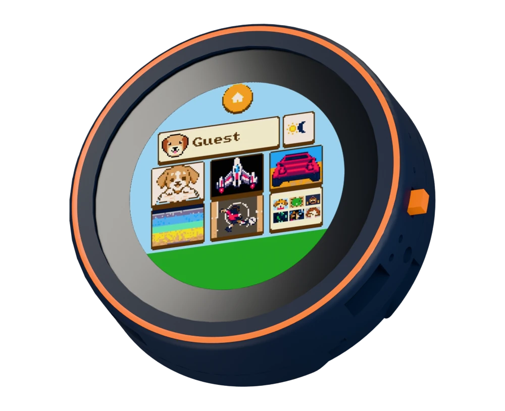
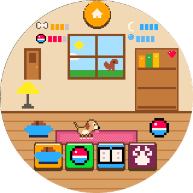
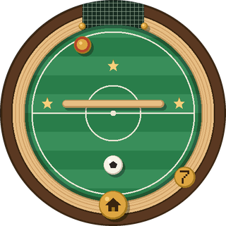
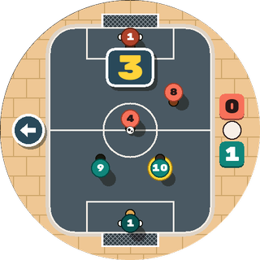
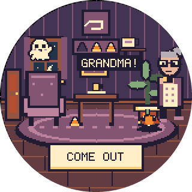
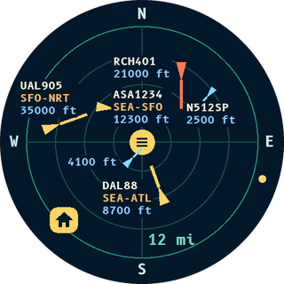
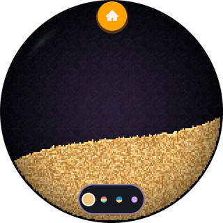
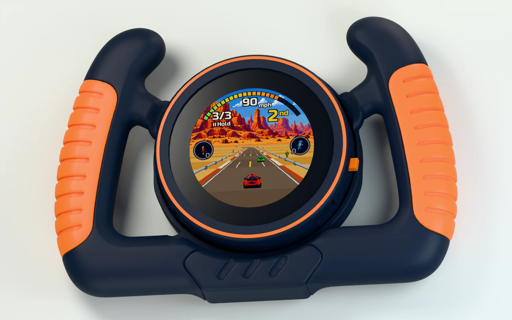
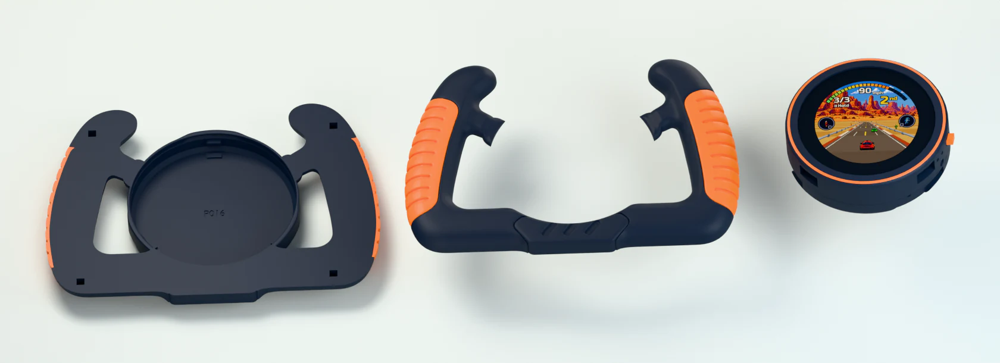

# Porthole

Open source firmware for a round Waveshare ESP32 touchscreen, with 12 small games and printable 3D models for a
case and a steering wheel. I built it for my kids, and hope yours will enjoy it, too.

**[Play it in your browser](https://porthole.dreamiurg.net/play/)**, no board needed: it is the real firmware,
built for the web. The [project page](https://porthole.dreamiurg.net/) has the same demo, a 3D hardware viewer
and an install guide. I write about this and other projects on my [blog](https://dreamiurg.net/).

## Games

All of them run in one firmware. Each kid gets a profile, up to four per board. No game punishes a kid who is
away: nothing dies, and no progress is lost.

| | | | |
| :---: | :---: | :---: | :---: |
|  **Pets Club** a pixel puppy that grows over real days |  **Biscuit** read stories with a pup, find 96 discoveries |  **Marble Kick** tilt a marble through 12 mazes |  **Tilt FC** street football: tilt to run, tap to pass |
|  **Pumpkin Hide & Seek** grab three candies before Grandma finds you |  **Radar** live planes over your home |  **Starfighter** bank to fly, tap to fire |  **Kingdom** a 40-scene story where choices matter |
|  **Toy Town** a doll town: school, café, park |  **Rally** hold it like a wheel and race |  **Sand Jar** tilt sand, water and stars |  **Times Cards** times tables, a few minutes a day |

More about each game: [apps/porthole/README.md](apps/porthole/README.md).

## Software

The firmware is C++ on Arduino and PlatformIO. A host simulator and a browser emulator run the same code on a
computer, so you can build and test a game without the board.

- **Put it on a board:** plug the board into a computer over USB-C, open
  [porthole.dreamiurg.net](https://porthole.dreamiurg.net/#install) in Chrome or Edge and press **Install**.
  You do this once: after that the board updates itself over Wi-Fi. Details and the manual way:
  [docs/install.md](docs/install.md).
- **Build from source:** `make check`, then `make flash APP=porthole`. Setup:
  [docs/development.md](docs/development.md).
- **Make your own game:** point Claude Code or Codex at the repo and describe what you want.
  [AGENTS.md](AGENTS.md) holds the rules it follows, and [docs/new-app.md](docs/new-app.md) the app contract.

Every merge ships a beta, and a beta becomes stable after three quiet days ([docs/releases.md](docs/releases.md)).

## Hardware

**The board** is the [Waveshare ESP32-S3-Touch-LCD-2.1](https://www.waveshare.com/esp32-s3-touch-lcd-2.1.htm):
a 2.1-inch round 480x480 touchscreen with an ESP32-S3, a motion sensor, a clock, a buzzer and a battery plug.
About $35 from Waveshare or $45 on [Amazon](https://www.amazon.com/dp/B0DDPQSKJD). Get the flat 2.1-inch
model; the other sizes and the curved 2.1B are not supported. Specs and pins: [docs/hardware.md](docs/hardware.md).

**The case** holds the board and a protected 3.7 V LiPo (2000 mAh or more, 1.25 mm plug).
Check the plug polarity first, as many batteries ship reversed. The [P014 pinstripe case](hardware/case/stl/twist-lock/r3-pinstripe) has a Deep Midnight bezel with a thin Hot Orange ring and a twist-lock lid that fits the wheel. [Rotate or take apart the case in 3D](https://porthole.dreamiurg.net/#case).

### V13 kid steering wheel

The 172 mm wheel has ribbed Hot Orange grips on a Deep Midnight blue body. Drop the puck into the recessed hub and turn it 30° clockwise to lock. The screen sits about 4 mm above the grips so small thumbs have a shorter reach to Rally’s buttons.

[Download the complete wheel on one H2D plate](https://github.com/dreamiurg/porthole/raw/refs/heads/main/hardware/grip/stl/v13-kid/bambu/V13-wheel-H2D.3mf) · [Rotate the assembled wheel in 3D](https://porthole.dreamiurg.net/#wheel)

The single-plate project includes both halves and four pins. For replacement parts, use the [P017 front](hardware/grip/stl/v13-kid/bambu/P017-front.3mf) and the [P016 back with four alignment pins](hardware/grip/stl/v13-kid/bambu/P016-back.3mf). The Bambu Studio projects assign both PLA colors. If you already have a P016 back, print just the new front. Both the pictured pinstripe case and the [standard R2 case](hardware/case/stl/twist-lock/r2) also fit the [215 mm adult wheel](hardware/grip/stl/v9-adult).

To retrofit a printed V8 kid wheel, remove the center cover and steel ring, dry-fit the [R2 hub](hardware/case/stl/twist-lock/r2/retrofit/wheel-hub-r2.stl)
with its index pointing up, then glue it in place. For a quick fit test, use the [lid and hub gauges](hardware/case/stl/twist-lock/r2/fit-test).
Browse the [wheel versions](hardware/grip) and [puck versions](hardware/case/stl) for earlier builds.

## Contributing

Fixes, new stories and new games are welcome. [CONTRIBUTING.md](CONTRIBUTING.md) has the workflow.
