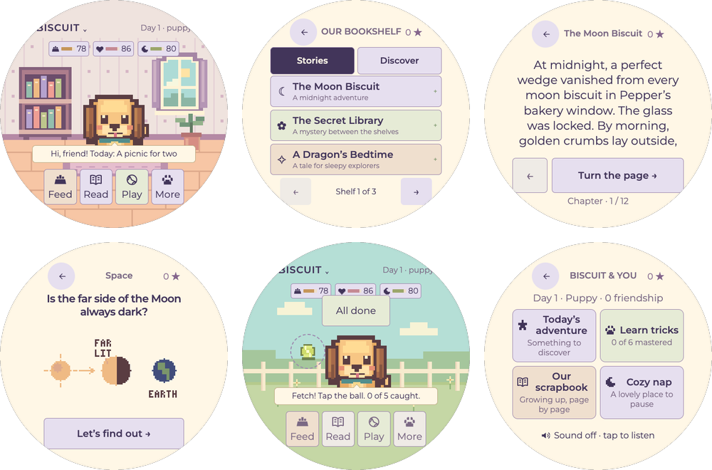
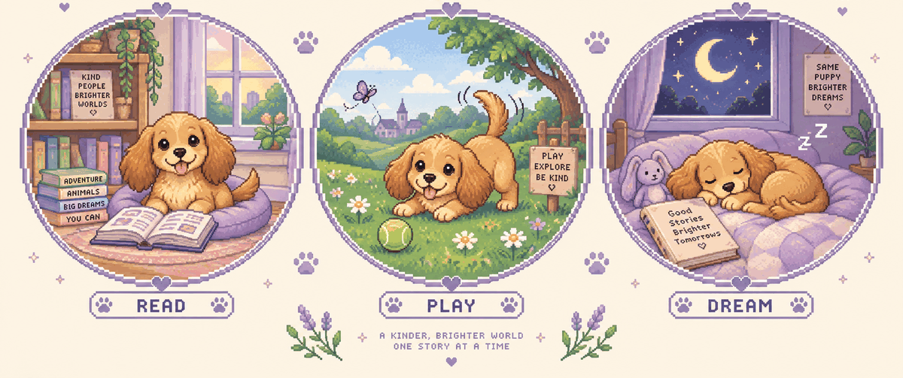

# Biscuit

A little dog with a big bookshelf.

Biscuit is a golden pixel puppy who lives on a round 2.1-inch touchscreen. Feed him, cuddle him, play fetch, teach him tricks, and read branching mysteries together. He grows from a puppy into a story dog over the days you visit, keeps every book and sticker you earn, and never gets sick, runs away, or holds a grudge about the weekend you forgot him. It is made for kids who love dogs and reading, roughly 7 to 11, and strong readers.



The same game runs in two places:

- **In a browser**: plain HTML/CSS/JavaScript, no install beyond Node.
- **On the Waveshare ESP32-S3-Touch-LCD-2.1**: native firmware in [`firmware/`](firmware/README.md), fully offline, every control on the screen.

The easiest way to put it on a board is the [web installer](https://dreamiurg.net/porthole/): open it in Chrome or Edge, plug the board in, press Install.

## Play in the browser

Needs Node.js 22 or newer.

```sh
npm start
```

Open http://127.0.0.1:4173 (use `PORT=4174 npm start` if that port is taken). Progress is saved in the browser's localStorage.

What's inside:

- Care: feed, cuddle, nap, and a gentle fetch game. Needs never drop below a floor.
- Reading: seven original branching mysteries, each with two investigative paths; four unlock over later days.
- Discover: 96 illustrated, sourced discoveries across 12 topics, three daily suggestions, and a notebook for favorites.
- Tricks: sit and paw on day one, then twirl, bow, hop, and roll over. Three practices to master each, no timer.
- Daily: a pocket word, three optional activities, and twelve permanent stickers.

Days don't need to be consecutive, and time away never removes friendship, stories, tricks, or stickers. Sound starts muted. Everything works with touch or keyboard and respects reduced motion.

## Build and flash the firmware

Needs [PlatformIO Core](https://platformio.org/install/cli) and Node.js 22 (the firmware's art and text are generated from the browser game at build time). From this directory:

```sh
make firmware                      # build
make flash                         # upload; PlatformIO auto-detects the port
make flash PORT=/dev/ttyUSB0       # or name it explicitly
make monitor                       # serial log at 115200 baud
```

The board config is shared across porthole apps in `../../platform/waveshare-round.ini`. See [firmware/README.md](firmware/README.md) for backup/restore of the original flash and hardware details.

### Set the clock

After flashing, set the board's real-time clock from your computer (uses PlatformIO's Python, which includes pyserial):

```sh
python firmware/tools/device.py --port /dev/ttyUSB0 time
```

On a Mac with one board attached you can leave out `--port`. You can also set the date and time on the device under More → Settings. The firmware defaults to US Pacific time; change `timezoneRule` in `firmware/src/main.cpp` for your region.

## Checks

Run `npm ci` once (it installs Biome, the only dev dependency), then:

| Command | What it runs |
| --- | --- |
| `make check` | `lint` + `test` (fast; the pre-commit hook runs this) |
| `make lint` | `node --check` on all JS, Biome lint, flash partition layout check |
| `make test` | Node tests (`tests/*.test.js`) and the native pet-model test (`firmware/tests/pet_test.cpp`) |
| `make coverage` | Node tests with coverage thresholds; LCOV at `build/coverage/lcov.info` |
| `make fonts-check` | Committed LVGL fonts match the generator (downloads `lv_font_conv`, needs network) |
| `make ci` | `check` + `coverage` + `fonts-check` |
| `make firmware-test` | Layout test of every label and reading page with the real fonts (run `make firmware` first) |

`npm test` and `npm run check` also work.

Coverage excludes `src/app.js` (DOM wiring that Node tests can't reach) and `server.js`.

Biome runs lint only; formatting is not enforced. One rule is off, with its reason in `biome.jsonc`: `suspicious/useIterableCallbackReturn`, because concise `forEach(x => d.line(...))` arrows are the drawing idiom in the pixel-art code. Long hand-drawn art and UI functions carry per-function `biome-ignore` comments for cognitive complexity instead of a looser global limit.

## More

- [Game design and research](docs/game-design.md)
- [Display constraints](docs/display-profile.md)
- [Browser verification notes](docs/verification.md)
- Fonts: Montserrat, SIL Open Font License 1.1, see [assets/fonts](assets/fonts/README.md)

## Concept art

The first sketch of Biscuit's world. The game itself uses its own lightweight pixel sprites.


