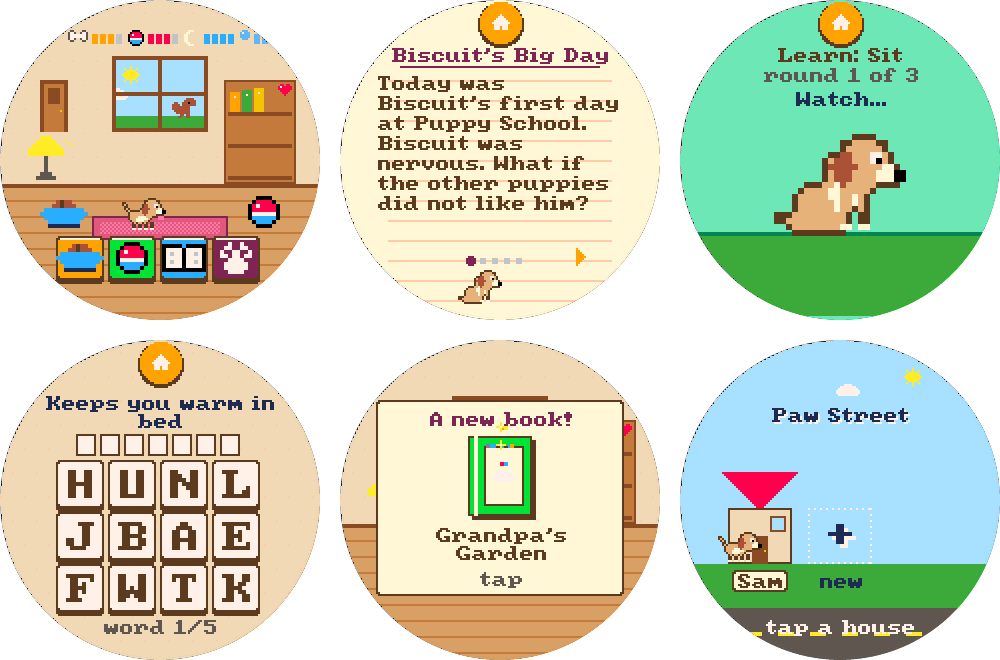

# Pets Club: a pixel puppy for a round screen

A touch-only, Tamagotchi-style puppy for the **Waveshare ESP32-S3-Touch-LCD-2.1** (round 480×480
IPS, capacitive touch, no buttons). Made for kids aged 5-10 who like dogs and books: the puppy
grows over real days, learns tricks, and above all loves being **read to**. Up to three kids can
share one board, each with a house of their own on Paw Street.

Everything is drawn at 160×160 in a 32-color retro palette and scaled up 3× to the panel.



## What it does

* **Adopt.** A parcel arrives and a puppy pops out. The kid types their name, picks their age and
  names the pup.
* **Home.** One cosy room: a window with day, night, rain and a visiting squirrel, a bookshelf that
  fills up with unlocked books, a lamp to tuck the dog in, a food bowl, a toy ball. Four big
  buttons: **feed · play · read · tricks**. Tap the dog to pet it; hold for a belly rub.
* **Needs, gently.** Food, fun, sleep and clean decay slowly and **stop at a floor: the dog never
  dies, runs away or resets.** Poop shows up a few hours after meals (one tap cleans it); muddy
  paws after playing mean a bath you give by rubbing the mud off.
* **Read.** A library of 30 original short stories in three reading levels, 5 to 11 pages each.
  The dog sits and listens, and each story ends with one comprehension question. Reading is the
  biggest source of bond hearts.
* **Play.** *Fetch*: slide to catch falling bones and dodge the bee. *Word Fetch*: read a clue,
  tap letter tiles to spell the word.
* **Tricks.** Eight tricks (sit, shake, speak, spin, roll over, play dead, beg, dance) unlock
  with bond hearts, each learned in three Simon-says lessons on three different days.
* **Day after day.** The real-time clock drives it all: a gift every new calendar day (a book, a
  hat, a party on day 7), a day streak, growing from puppy to dog to grown dog, sixteen stickers,
  bedtime at 8 pm. Time away counts for at most 12 hours and nights are slept through, so a
  weekend off never punishes anyone.
* **Paw Street.** One house per kid, each with its own pup, room colors and bookshelf, optionally
  locked with a 4-digit code. With two or more houses a pup naps after about 6 minutes of play,
  so the board passes to the next kid.
* **Reading level by age.** Stories and spelling words scale with the age picked at adoption:
  level 1 at 5-6 up to level 3 from 9.
* **Quiet by design.** The buzzer is harsh, so it only sounds for rare moments (growing up, a
  new trick, a gift, a sticker). Each house can mute it on the stats screen.

## Play it without the board

You need a C++17 compiler and Python 3. From this directory (`apps/pets-club/`):

```bash
make snap && python3 tools/webemu.py   # or: make webemu
```

Open http://127.0.0.1:8765 (`python3 tools/webemu.py 8766` for another port). The mouse is your
finger; the buttons under the screen skip time and force states (hungry, muddy, grown...) so you
can see a week of play in a minute.

With SDL2 installed, `make sim` opens a native window instead: `h` / `n` / `d` skip 1 hour, 8
hours, 1 day; `r` resets; `s` saves a screenshot to `build/host/shot.bmp`; `q` quits.

## Build and flash

Needs [PlatformIO](https://platformio.org/). The board config is shared across the monorepo
(`../../platform/waveshare-round.ini`); the first build downloads the toolchain and takes a few
minutes.

```bash
make firmware                                # pio run -e firmware
make flash                                   # PlatformIO finds the port on its own
make flash PORT=/dev/cu.usbmodemXXXX        # ...or name it (Linux: usually /dev/ttyACM0)
make monitor                                 # serial log at 115200 baud
```

On first boot the clock is set from the build time. To set it exactly, send `T<epoch>` over serial
using local wall-clock seconds, e.g. `printf 'T%s\n' "$(date +%s)" > /dev/cu.usbmodemXXXX`.

### Serial commands (115200 baud)

| Command | Effect |
| --- | --- |
| `S` | print stats, free heap and the current epoch |
| `T<epoch>` | set the clock (local wall-clock seconds) |
| `R` | erase every house and reboot |
| `P<n>` | clear the secret code of house `n` (the parent escape hatch) |
| `D` | toggle touch-position logging |

## Checks

```bash
make check      # content fits its pixel boxes, sprites are current, -Werror build, pet self-test (seconds)
make playtest   # 16 scripted playthroughs, a UI audit (target size, bezel, overlap, contrast), chaos monkeys under ASan
make ci         # check + playtest + coverage: what CI runs for this app, minus the firmware build
make coverage   # line coverage of src/game/*.cpp -> build/coverage/coverage.xml (needs gcovr, or uvx)
```

The playtest report lands in `build/playtest/report.md`, with contact sheets next to it if
Pillow is installed.

## Hardware notes

| Function | Where |
| --- | --- |
| LCD | ST7701, 16-bit RGB, pins per the Waveshare wiki; init over 9-bit SPI on GPIO1/2 with CS on the expander |
| Touch | CST820, I²C 0x15 on SDA 15 / SCL 7 |
| IO expander | TCA9554 @ 0x20: P0 LCD reset, P1 touch reset, P2 LCD CS, P7 buzzer |
| RTC | PCF85063 @ 0x51, set from build time on first boot, restored from the save if it stops |
| Backlight | GPIO6 PWM; dims after 1 min idle, off after 5 min (tap wakes), off 20 s after bedtime |
| Storage | NVS (`Preferences`), one 156-byte blob per house (`s0`..`s2`) with CRC; older single-house saves migrate on first boot |
| Serial | UART0 through the on-board CH343 USB bridge, 115200 baud |

Rendering: two 480×480 RGB565 framebuffers in PSRAM with bounce buffers; each frame the 160×160
indexed buffer is expanded through the palette into the back buffer and swapped on vsync.
Day / evening / night are palette variants applied at flip time.

## Layout

```
src/game/      platform-independent game: pet simulation (pet.cpp), screens (game.cpp),
               renderer (gfx.cpp), stories & words (content*.h), generated sprites (sprites.h)
src/board.cpp  Waveshare board layer (display, touch, expander, RTC, buzzer, NVS)
src/main.cpp   firmware entry: input, saves, idle dimming, serial commands
host/          SDL2 / headless simulator and the pet self-test
tests/         playtest scenarios
tools/         pixel-art rig (art.py), browser emulator, playtest runner, content checker
```

Contributing, or pointing an AI agent at it? Read [CLAUDE.md](CLAUDE.md) first: it has the hard
constraints (round screen, 32 colors, ASCII only, append-only saves, the pet never dies) and the
workflows.

## Credits

* 8×8 font: `font8x8` by Daniel Hepper, public domain.
* Panel init sequence and pin map: Waveshare ESP32-S3-Touch-LCD-2.1 demo code.
* Palette: PICO-8's 16 colors plus 16 extras.
* Stories, art rig and game design: written for this project.
