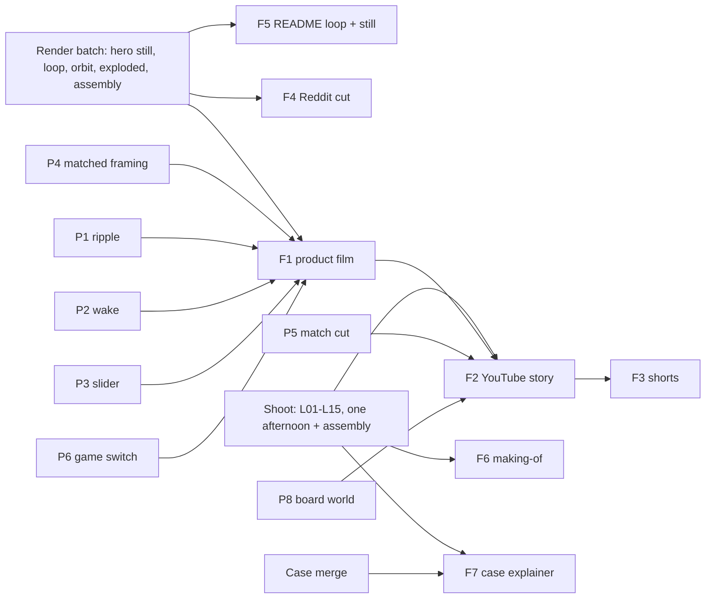

# Porthole promo: formats and concepts

Status: exploration for the author to choose from. Nothing here is scheduled. The 30-40 s Reddit
cut in [`brief.md`](brief.md) stays valid; it is now one format among seven.

Every mechanic and number below was checked against `README.md`, `apps/porthole/README.md` and
`tools/promo/` today. Where a fact is an assumption it says so. Ground rules that apply to every
format, restated once so no beat below has to:

- The kids never appear: no faces, no hands, no voices. "Made with my kids" is said in words and
  shown through the game (the "Who's playing?" picker with invented names).
- On camera: the author's hands. His face only where a beat is marked face-optional.
- No AI-generated video, images of people, voice or music. Music is Kevin MacLeod, CC BY 4.0,
  credited exactly as the brief specifies. Blender renders of the real CAD and real game frames are
  fine; so is anything the author films or screen-records.
- "Made with Claude Code" is said plainly and specifically. The line, to be reused verbatim across
  formats so it never drifts: *"I decided what the games are, the rules (nothing dies, 25 minutes a
  day), how they look, and what to ship. Claude Code and Codex wrote most of the code. I read it,
  ran it, and flashed it."* Never "AI-powered", never "built by AI".
- The case files are not merged. No format promises a download for them. The wording is "the case
  is on its way to the repo" or nothing.

## 1. Format map

Seven formats earn a place. Each is one deliverable with one job; the reuse matrix (section 4)
shows they share almost all their material.

| # | Format | Audience, platform | Length | Logline | Why it works | What kills it |
| --- | --- | --- | --- | --- | --- | --- |
| F1 | Rendered product film | Makers and pet-game people who found the repo or a post; YouTube (unlisted, embedded), the project page, Reddit comment links | 50-60 s, 16:9 master, 1:1 crop | A pixel puppy on a $40 round screen, then the printed puck it lives in, then the words "free, MIT". | The render pipeline exists; the film needs no shoot, no voice, and can be re-rendered when a game changes. Two openings (screen-first, object-first) cover both "is it a game?" and "is it a gadget?" viewers. | Looking like a Kickstarter. A rendered puck on a rendered table is one wrong material away from an ad. The fix is pixel-exact game footage for most of the runtime, and the 3D only where the object matters. |
| F2 | YouTube build story | Makers, ESP32 people, Claude Code users, parents who tinker; YouTube (public), linked from every post | 2:30-3:30 (voice-over), 2:00-2:30 (text-only) | A dad builds a plane radar with his kids, wants a bigger screen, ends up with two games and a printed puck. | This is the only format that can tell the actual story (radar, board hunt, arrival, games, case), and the research's best-sourced structures (open on the thing, show the setbacks, disclose plainly) fit it. It becomes the canonical link. | A "hi, I'm a dad" opener, a talking head for more than 15 s, or a kids-reaction beat that can't be shot. Also: soldering footage staged for the camera when the build needed none. |
| F3 | Vertical cut-downs | Shorts, Reels, TikTok; anyone who reposts | 3 clips, 15-30 s each, 9:16 | (a) A week of a puppy in 10 s. (b) The puck comes apart. (c) "Change the hat": a prompt, then the screen changes. | Self-contained beats that already exist in F1/F2, reframed. Muted-feed viewers read captions, not a story. | Making them first. They are cheap only as derivatives; built from scratch they cost as much as F1. |
| F4 | Reddit post media | r/esp32, r/tamagotchi, r/ClaudeAI, r/ClaudeCode, r/daddit, r/SideProject | 30-40 s master, 6-10 s GIF, one still | The brief's cut: adopt, real days, care, read, Biscuit, whose turn, end card. | Already designed; native Reddit video plus a GIF and a still per subreddit's taste. | Unchanged from the brief: reads as an ad on r/esp32, "no stakes" on r/tamagotchi, "another screen" on r/daddit. |
| F5 | README / GitHub hero loop | Anyone landing on the repo or the project page | 6-8 s silent loop (MP4 and GIF), one 1:1 still for OpenGraph | The puppy grows on the device on the table; the loop cut hides on the day-0 frame. | First thing visitors see; costs one render batch; makes the README screenshot strips feel alive. | A loop that "pops" at the seam. Cut back to day 0 on a matching Home frame, no fade. |
| F6 | Making-of for r/ClaudeCode, r/ClaudeAI | Claude Code users, people deciding whether to try agent-assisted hardware | 60-90 s, 16:9, plus a text post | What I asked for, what it wrote, what I changed my mind about. Terminal on the left, the little screen on the right. | Nothing like it exists in the research corpus (a stated gap: no sourced example of a hardware project disclosing an AI coding assistant). Specific beats a vague "built with AI" and is what that audience wants to see. | Showing a prompt as the product. The screen must change on camera; otherwise it is a demo of a chat window. Also: any real kid request quoted verbatim with a name. |
| F7 | Case explainer | r/3Dprinting, r/functionalprint, the MakerWorld page once the case is published | 30-40 s, 16:9 | Ring, plate, cup, slider: a board and a protected LiPo in a printed puck, three screws, no soldering. | The 16 s assembly clip already exists; add the exploded still with labels and the macro shots. It is the MakerWorld listing video. | Publishing before the STLs are in the repo. Hold it until the case merges; everything in it is reusable in F1 and F2 meanwhile. |

Killed, one sentence each:

- A board comparison video ("I tried six ESP32 screens"): the author compared spec sheets, not
  boards on a bench; claiming otherwise fails the truth test and the "board world" beat in F2 says
  what is true in 15 s.
- A talking-head walkthrough of the code: r/esp32 wants the engineering in the post body, in
  three lines, not a screencast.
- An unboxing: the board arrives in a bag in a box; it is one 3 s shot in F2, not a format.
- A kids' reaction video: cannot be shot under the constraints, and the picker screen says it better.
- A live stream or a multi-part series: the story is done; a series would be padding.
- A Hackaday-style written feature with an embedded video: that is a post, not a format; F2 is
  the embed.

## 2. Beat sheets

Conventions: timecodes are targets. "2D exact" means `film.py` output: real sim frames at integer
scale, touch marker, captions in the band. "3D" means `scene.py` in Cycles with the real frames on
the panel. "Author" is phone footage or a screen recording. Captions everywhere are Montserrat
regular, one line, same position across cuts, in the brief's caption voice. Sound is music unless a
beat says otherwise; the sim's buzzer is never used.

### F1 Rendered product film (target 55 s, 16:9 master, 1:1 and 9:16 derived)

Two openings, same body from 0:08. Pick one after seeing EEVEE previews of both; my pick is A for
Reddit-adjacent viewers (they came for the game) and B for the project page (they came for the
object). If only one gets made, A: it puts a face on screen at frame one and needs the fewest new
pipeline pieces.

Opening A: screen-first, then pull back.

| Time | Source | Picture | Sound | Into the next beat |
| --- | --- | --- | --- | --- |
| 0:00-0:04 | 2D exact | "Knock knock!" parcel, a tap, "A puppy!": the pup's face fills the circle. No caption. | Silence, then the music's first downbeat on the pup's pop. | Hard cut on the pop to the same screen, now on the 3D panel. |
| 0:04-0:08 | 3D hero, matched framing (P4) | Frame one is the 3D camera dead top-down with the circle at the exact position and size of the 2D frame; the camera rises and tilts to three-quarter: wood counter, grey puck, daylight. Caption: "A puppy on a $40 round screen." | Music continues. | Cut on the beat to the Home screen, 2D exact. |

Opening B: object-first, then push in.

| Time | Source | Picture | Sound | Into the next beat |
| --- | --- | --- | --- | --- |
| 0:00-0:03 | 3D macro | The puck on the counter, side-low, screen dark. The slider knob moves (P3); the panel wakes from black (P2) on "Who's playing?". No caption. | Room tone from the music bed's intro; no sound effect. | Continuous camera. |
| 0:03-0:08 | 3D, push-in to top-down (P4) | The camera pushes in and levels until the circle fills the frame; a tap ripple (P1) on "Sam", the launcher, a ripple on Pets Club, the adopt screen. Caption on the push-in: "A puppy on a $40 round screen." | Music's first downbeat on the ripple. | Hard cut to 2D exact on the identical adopt frame. |

Shared body.

| Time | Source | Picture | Sound | Into the next beat |
| --- | --- | --- | --- | --- |
| 0:08-0:17 | 2D exact | Real days: day 0 puppy at Home, parcel on the sill, "Day 4" dog with the grew-up celebrate, "Day 7" party hat, "Day 10" grown. Needs left to decay between days (the brief's honest option). Captions: "It grows over real days." then "Miss a week. It waits." | Cuts on the beat, one per day change. | Hard cut. |
| 0:17-0:23 | 2D exact | Care: bowl, tap the dog, rub the mud off, Fetch with the bee. Caption: none. | Music. | Hard cut. |
| 0:23-0:30 | 2D exact | Read: bookshelf, a story page, the question after the story, a trick lesson ("Learn: Sit"). Captions: "You read. The pup listens." then "30 stories. Eight tricks." | Music drops to its quiet section here; the reading beat is the calm center. | Hard cut to the launcher on the 3D panel. |
| 0:30-0:36 | 3D orbit, `--smooth`, game switch (P6) | The launcher on the panel, ripple on Biscuit; Biscuit's Home in full color, a two-choice story page, a discovery with its "I wonder..." line. Caption: "Biscuit: stories with two endings. 96 things to find out." | Music. | Cut on the beat. |
| 0:36-0:41 | 3D hero | "Who's playing?" with four invented faces; then the rest screen "Back tomorrow". Caption: "Four kids, one board. 25 minutes a day, then it says goodnight." | Music. | Optional match cut to the real puck (L07) here if the shot exists; else hard cut. |
| 0:41-0:49 | 3D exploded, then assembly (reverse segment) | The exploded still resolves into the assembled puck: ring, board, plate, cell, slider, cup. Then a macro pass over USB-C, the slider and the layer lines. Caption: "A printed puck. A board and a battery inside. No soldering." | Music builds back. | Hard cut. |
| 0:49-0:55 | 3D hero still, text | The puck at rest with the puppy on screen; repo URL; board name. Captions: "Free. MIT. Flash it from Chrome." and, smaller: "Made by a dad and his kids, with Claude Code." | Music resolves and stops with the last caption. | End. |

Render budget: about 27 s of 3D at 25 fps is roughly 680 Cycles frames; at 7-15 s a frame on an
M3 Max that is 1.5-3 hours unattended. The 2D beats are free. Previews in EEVEE first, always.

### F2 YouTube build story (target 3:00 voice-over; 2:15 text-only)

Structure follows the research where it is sourced: the thing on screen inside 5 s, the promise by
15 s, a real setback in the body, disclosure specific and unhidden, the ask at about 60-70%, no
greeting, no logo, no apology. Chapters are named so YouTube chapters can use them.

Three cold opens (0:00-0:08). Pick one; my order of preference is 1, 3, 2.

1. **The radar.** Author footage: the tiny Plane Radar on the desk, planes drifting on its 1.28-inch
   screen. A hand sets the grey puck down beside it, screen on, puppy in a party hat. VO: "This one
   started it." Text-only: card "It started with this."
2. **Day 7.** 3D hero: the puppy on the device grows puppy, dog, party hat, grown in four cuts.
   VO: "My kids' puppy. It grows over real days, and it never dies. Here's how it got here." Text-
   only: the four day captions, then "How this got made."
3. **The prompt.** Screen recording: a single line typed into Claude Code ("give the dog a party
   hat on day 7"), cut to the small screen where the hat appears. VO: "My kids asked for that. I
   typed it. It showed up. That was the whole idea." Text-only: the typed line is the caption.

Beat sheet. VO column is the gist and one sample line, not a script; the text-only column is the
card or caption that replaces it. Text-only runs about 25% shorter because cards read faster than
speech; trim the middle of each beat, not the number of beats.

| Time (VO) | Chapter, beat | Source | Picture | VO (author) | Text-only | Into the next beat |
| --- | --- | --- | --- | --- | --- | --- |
| 0:00-0:08 | Cold open | see above | | | | Hard cut. |
| 0:08-0:20 | The promise | 3D hero, then 2D exact | The puck on the counter; the screen: Pets Club Home, then Biscuit Home. | "Two games for kids, on a $40 round screen, in a puck I printed. Free, MIT. I made them with my kids and with Claude Code; I'll say exactly what that means later." | Cards: "Two games. A $40 round screen. A printed puck." / "Free. MIT." / "Made with my kids and Claude Code (details at the end)." | Cut to author footage. |
| 0:20-0:45 | 1. The radar | Author L01, L02 | The Plane Radar running. Then split: terminal left (screen recording), the little radar screen right (phone), a change requested and appearing. | "MatixYo's ESP32 Plane Radar on MakerWorld. We built it, and then I showed the kids they could change it: they'd ask, I'd type, and it showed up on the screen. They kept asking." | Cards: "ESP32 Plane Radar, by MatixYo." / "The kids asked for changes." / "They appeared on the screen." | Hard cut to the board-world sequence. |
| 0:45-1:05 | 2. A bigger screen | 3D board world (P8), then author L03 | Simple 3D cards of the boards he actually compared, the Waveshare one comes forward; then the box on the counter, the board out of its bag. | "I wanted a bigger screen. That's how I found out there are dozens of these boards. I wanted round, touch only, enough memory to double-buffer the screen, a real-time clock, one USB-C cable. This one." | Cards: "Bigger screen?" / "Round. Touch only. Double-buffered. A clock. One cable." / "Waveshare ESP32-S3-Touch-LCD-2.1, $35-45." | Cut to the bare board waking. |
| 1:05-1:20 | Arrival | Author L05, L06 | USB-C in, the bare board wakes; the radar running on the 2.1-inch screen. | "First thing we did: the radar again, bigger. Then the kids asked the question that mattered: can we make our own?" | Cards: "First, the radar again." / "Then: can we make our own?" | Hard cut to 2D exact. |
| 1:20-2:05 | 3. The games | 2D exact, 3D hero | Pets Club: adopt, real days, read, tricks. Biscuit: story choice, discovery. The picker with four faces, "Back tomorrow". | "Pets Club first: a puppy that grows over real days, learns tricks, and mostly wants to be read to. Then Biscuit, calmer, full color, stories with two endings and 96 things to find out. Four profiles, 25 minutes a day, then it says goodnight. Friends' kids got hooked too, which is when I decided to clean it up." Then the disclosure line, verbatim from the top of this file. | Cards per beat: "Pets Club: it grows over real days." / "It loves being read to." / "Biscuit: you pick the ending." / "Four kids, one board. 25 minutes a day." / the disclosure line as a full-screen card, held 5 s. | Hard cut to the exploded render. |
| 2:05-2:35 | 4. The puck | 3D exploded and assembly; author L09; match cut (P5) | The exploded render labels ring, plate, slider, cup, cell, board; the assembly clip; the author's hands doing the real assembly, three screws; the render lines up with the real puck and becomes it. | "The case: four printed parts, a protected battery, three screws, no soldering. The slider works the board's own power switch. PETG, so it survives a hot car." | Cards: "Ring. Plate. Slider. Cup." / "A protected LiPo. Three screws. No soldering." | Hard cut to the screen recording. |
| 2:35-2:55 | 5. Yours | Author L13, text | esptool-js in Chrome writing `factory.bin`; the board rebooting; the repo page. | "It's free and MIT. Download the release, plug the board in, flash it from Chrome, no tools. The case is on its way to the repo. If you build one, or a new game, tell me." | Cards: "Free. MIT." / "Flash it from Chrome." / "github.com/dreamiurg/porthole" | Cut to the end card. |
| 2:55-3:05 | End card | 3D hero still | Puck, repo URL, board name, music credit line. | Silence under the credit. | Same card. | End. |

Face-optional variant: one 10-15 s piece to camera at the disclosure (2:00) and nowhere else. If
he does not want his face, the disclosure runs over the picker screen and the render, which is fine;
the research's voice-over case is that the invisible narrator is equally credible.

Setback beats, so the video is not a victory lap (this is the Wintergatan lesson and the only
sourced structural advice about maker stories): the board hunt is one (too many boards, spec-sheet
comparisons); the assembly is another if the slider needed a v4 (`hardware/case/stl/proto/` on the
branch suggests it did; confirm, open question 5). One line each, shown, never apologised for.

### Text-only F2, length note

At 2:15 the beats are the same; the middle of "The games" and "The puck" lose their second half.
Cards use the caption band, never a full-screen wall of text except the disclosure, which deserves
the screen to itself.

## 3. The author's shot list

Every live shot across all formats, deduplicated. All hands-only unless marked face-optional. All
on a tripod or a phone mount; exposure and focus locked before rolling (the one first-party rule in
the research, from Crowd Supply); no digital zoom, move the phone instead; one subject per shot;
daylight from a window, same time of day as the render's look. Film everything at 4K 25 fps (or 50
if the phone offers it), so 1:1 and 9:16 crops keep resolution. Invented profile names only on any
screen in frame. Shoot the puck clips before the render batch if at all possible: the real case's
grey sets the render's `--case` colour, not the other way round.

| ID | Shot | Framing | Feeds | Notes |
| --- | --- | --- | --- | --- |
| L01 | The Plane Radar running on the desk, planes moving | 30 degrees above, the whole tiny device, 10 s locked | F2 open 1, F2 ch.1 | Only if the radar build still exists and runs. |
| L02 | A change to the radar: screen recording of Claude Code plus the phone on the tiny screen as it updates | Screen capture at native res; phone straight down on the screen, 15 s | F2 ch.1, F2 open 3, F3c, F6 | Two sources, synced on the moment the screen changes. Pick a change that is visible in one glance (a colour, a label). Do not show any real kid request with a name. |
| L03 | The box; the board out of its anti-static bag, held in one hand | Top-down on the counter, then a hand lifts it, 8 s | F2 ch.2 | |
| L04 | Bare board, back side: USB-C, the slide switch, the battery plug | Macro, low side angle matching the Blender `macro` shot, 6 s | F2 ch.2, F7 | Lock focus; phones hunt on shiny boards. |
| L05 | USB-C in, the bare board wakes | Three-quarter, 5 s | F2 arrival | |
| L06 | The radar running on the 2.1-inch board | Same framing as L01 for the cut, 8 s | F2 arrival | Conditional on L01. |
| L07 | The puck on the kitchen counter, a thumb taps it awake to "Who's playing?" | Three-quarter, the puck about a third of the frame, 6 s | F1 match cut, F2 ch.2/ch.4, F4 slot 1, F3b | This is the render-to-real target (P5). Note the phone's position and height. |
| L08 | The puck in hand, thumb slides the power switch off and on | Macro, side-low, 5 s | F2 ch.4, F7, F3b | |
| L09 | Assembly: parts laid out (ring, plate, cup, slider, cell, board, screws); then the assembly, screwdriver, three screws | Top-down locked, 3-5 minutes real time, to be sped up | F2 ch.4, F7, F3b | The most valuable shot. Also shoot the disassembly if a second run is cheap: it cuts either way. |
| L10 | The cup printing on the Bambu, layer lines forming | Macro on the bed, 30 s | F2 ch.4, F7 | Optional; only if a print is happening anyway. |
| L11 | Playing on the real puck: tap the dog, turn a story page, a trick cue | Top-down, the circle filling most of the frame, 20 s | F2 ch.3, F4 slot 3 | Text on a phone camera is mush at feed size; the page-turn is for motion, not reading. |
| L12 | The puck set down on a shelf, screen on "Back tomorrow" | Three-quarter, 5 s | F2 ch.3, F4 slot 2 | One hand only, ever. |
| L13 | Flashing from Chrome: screen recording of esptool-js writing `factory.bin`; phone on the board rebooting | Screen capture; phone three-quarter, 15 s | F2 ch.5, F6 | Use a release file, not a dev build. |
| L14 | Face-optional: the author at the counter says the disclosure line | Head and shoulders, window light, 15 s | F2 disclosure | Only in the VO variant, only if wanted. |
| L15 | The puck beside the tiny radar, scale shot | Three-quarter, 5 s | F2 open 1, F5 alt still | Conditional on L01. |

Soldering: not in the list. The case needs none and the radar build, as far as the README says,
needed none either. If he soldered something real (a battery lead, a header), it is one shot in
ch.1 or ch.4; never staged.

## 4. Reuse matrix

Rows are assets, columns are formats. One shoot (section 3) and one render batch cover everything.

| Asset | F1 film | F2 YouTube | F3 shorts | F4 Reddit | F5 README | F6 making-of | F7 case |
| --- | --- | --- | --- | --- | --- | --- | --- |
| 2D exact: adopt | A open | ch.3 | | beat 1 | | | |
| 2D exact: real days montage | body | ch.3 | a | beat 2, GIF | loop (on 3D) | | |
| 2D exact: care, fetch | body | ch.3 | | beat 3 | | | |
| 2D exact: read, question, trick | body | ch.3 | | beat 4 | | | |
| 2D exact: Biscuit story, discovery | (on 3D) | ch.3 | | beat 5 | | | |
| 2D exact: picker, rest screen | (on 3D) | ch.3 | | beat 6 | | | |
| 3D hero still, party frame | end card | end card | | still | OpenGraph | | |
| 3D hero, matched framing (P4) | A open | promise | a | | loop | | |
| 3D macro: slider wake (P2, P3) | B open | ch.4 | b | | | | yes |
| 3D orbit, Biscuit, game switch (P6) | body | ch.3 | | | | | |
| 3D exploded (labelled) | body | ch.4 | b | | | | yes |
| 3D assembly clip | body | ch.4 | b | | | | yes |
| 3D board world (P8) | | ch.2 | | | | | |
| L01, L06, L15 radar | | open 1, ch.1 | | | | | |
| L02 terminal + screen | | ch.1, open 3 | c | | | core | |
| L03, L04, L05 board | | ch.2 | | | | | L04 |
| L07 puck wakes | match cut | ch.2, ch.4 | b | slot 1 | | | |
| L08, L09, L10 case | | ch.4 | b | | | | core |
| L11, L12 playing | | ch.3 | | slots 2, 3 | | | |
| L13 flash from Chrome | | ch.5 | | | | yes | |
| L14 face | | disclosure | | | | | |
| Music track (one) | yes | yes | yes | yes | (silent) | yes | yes |
| Caption set (one file) | yes | yes | yes | yes | | yes | yes |
| Disclosure line (verbatim) | end card | ch.3 | | post text | | core | |

Two consequences. First, F4, F5 and F1 need zero live footage; they are a render batch and an edit.
Second, F2 is the only format that needs the whole shoot, and F3, F6 and F7 are cut from F2's
material; none of them should be made before the shoot.

## 5. Pipeline additions

Named so they can become tasks. Sizes: small is an hour or two inside `scene.py` or `film.py`;
medium is a day with iteration; large is more than a day. Nothing here is large.

| ID | Addition | Needed by | Size | Notes |
| --- | --- | --- | --- | --- |
| P1 | Tap ripple on the 3D screen: an expanding ring composited onto the panel texture at the touch marker's position and frame | F1 B open, F1 Biscuit beat | small | `film.py` already tracks the finger per frame; write it to a sidecar and read it in `scene.py`. |
| P2 | Screen wake: the panel's emission ramps from black over about 300 ms | F1 B open, F7 | small | One keyframed emission strength. |
| P3 | Slider throw: `puck_slider.stl` translates along its channel over 8 frames | F1 B open, F7 | small to medium | The travel ends are in the CAD script on the branch; ask it, don't eyeball. |
| P4 | Matched framing: a `hero-flat` camera dead top-down with the circle at the 2D clip's exact position and size, and an animated move from it to `hero` and `orbit` | F1 A open, F5 loop, F3a | small | Cut on identical frames; the caption band must not be inside the 3D frame. |
| P5 | Render-to-real match cut: a contact-sheet tool that overlays a render frame on L07 at 50% so the camera can be hand-solved (height, tilt, lens) until the puck outlines agree | F1 optional, F2 ch.4 | medium | Needs L07 shot first. Cut on the tap, so the motion hides the residual mismatch. |
| P6 | Game switch on the panel: one frames directory spanning launcher to Biscuit, with `--smooth` switching per frame range | F1 Biscuit beat | small | A sim script already covers the shell; the filter toggle is the only new bit. |
| P7 | Vertical 9:16 output in `film.py` and `scene.py` (screen larger, caption band below) | F3, F4 vertical | small | Same timeline, different canvas. |
| P8 | Board world: 4-6 simple 3D cards (a disc or rectangle, the board's outline and name in Montserrat) on the counter, one comes forward | F2 ch.2 | medium | No photos of other boards (not ours); no other STEP files (only Waveshare's is fetched). Names only for boards he actually compared (open question 2). |
| P9 | Exploded still with part labels: leader lines and the five part names | F1, F2 ch.4, F7 | small | `caption.py` handles captions; labels need positions per part. |
| P10 | Text-card mode in `caption.py`: a full-frame card with one to three lines, held N seconds, same font | F2 text-only, F6 | small | |
| P11 | Caption position: the brief says below the circle; `film.py` composes the band above (`CY = 600`). Decide once and make both formats agree | every format | trivial | Below matches the rest of the plan; captions above the circle read as a title. |
| P12 | Loop export: a `--loop` that renders the montage and appends the cut back to day 0 on a matching Home frame, then GIF and silent MP4 | F5, F4 GIF | small | |
| P13 | Terminal-and-screen split composite for L02: screen recording left, phone right, synced on a marker frame | F2 ch.1, F6 | small | ffmpeg, no pipeline code. |
| P14 | Optional: the sunlight sweeps across the counter during the real-days montage on the 3D panel, one sun angle per day | F1, F5 | medium | Only if the montage plays on the 3D panel; skip if it stays 2D. Nice, not needed. |

## 6. Recommended order

Goal: something postable this week without a shoot, the shoot as one afternoon, the YouTube video
last because it consumes everything else.

| Step | What | Effort (agent-assisted, calibrated) | Unblocks |
| --- | --- | --- | --- |
| 1 | P11, P12, P4; render the hero still and the loop; put both in the README and the project page | Story-sized: 1 day, plus 1-2 h unattended render | F5 done. Postable immediately. |
| 2 | Pick the music (1-2 h by ear against the brief's tempo target); cut F4 from 2D exact plus the hero end card; the three phone slots stay empty | Story-sized: 1-2 days | F4 ready; the four Reddit posts can go out. |
| 3 | P1, P2, P3, P6, P9; render F1 with opening A; B only if A previews badly | Feature-sized: 2-4 days, of which about 3 h is render time | F1 done; the project page has its film. |
| 4 | Shoot L01-L15, one afternoon plus the assembly session | 1 author afternoon; no agent work | Everything below. |
| 5 | P5, P13; F6 making-of (60-90 s) from L02 and L13 with the disclosure card | Story-sized: 1-2 days | The r/ClaudeCode and r/ClaudeAI posts. |
| 6 | P8; script, VO recording (or cards), edit F2 | Feature-sized: 4-6 days; the research's generic figure for a 10-minute VO (roughly a day of scripting, recording and post combined, scaled to 3 minutes) is consistent with this | F2 done; every post links to it. |
| 7 | P7; F3 shorts a, b, c from F1 and F2 material | Story-sized: 1 day | Vertical feeds. |
| 8 | F7 case explainer from the exploded, assembly, L08, L09, L10 | Story-sized: 1 day, after the case merges | The MakerWorld listing. |

Assumptions behind the estimates:

- The author edits in one NLE he already knows; the estimates include the edit, not learning a tool.
- Render time is wall time, not effort; an M3 Max renders overnight.
- The case's real print colour is the grey PETG the renders use, so the match cut and the bezel
  need no re-render (open question 4).
- Calendar time is longer than the totals: the shoot depends on daylight and a free afternoon, and
  the music pick and VO record are single-sitting tasks that tend to slip.
- Total agent-assisted effort for all seven: 10-17 days, spread across the sequence; F5 and F4
  alone are 2-3 days.

## 7. Open questions for the author

These change the concepts. Everything else is a later role's call.

1. **Face or no face?** Decides L14, the VO variant, and whether F2's disclosure is a piece to
   camera or a card over the render. Default if unanswered: no face, voice-over.
2. **Which boards did you actually compare, by name?** The board-world beat (F2 ch.2, P8) names
   only those. If it was a spec-sheet skim of a dozen, the beat says "dozens" and shows five
   unnamed shapes.
3. **Does the Plane Radar build still exist and run?** L01, L02, L06 and L15, cold open 1, and the
   whole of F2 ch.1 depend on it. If it is gone, ch.1 becomes a 10 s card over the MakerWorld page
   (screen recording) and cold open 1 is out.
4. **Is the printed case grey PETG, as the renders assume?** The real colour sets `--case`, the
   brief's bezel, and the match cut. Shoot L07 before the render batch if there is any doubt.
5. **Did anything go wrong that we can show?** The slider looks like it took a v4; the board hunt
   took a while. One real setback, shown, is worth more than any render. Was anything soldered,
   ever? If not, the word never appears.
