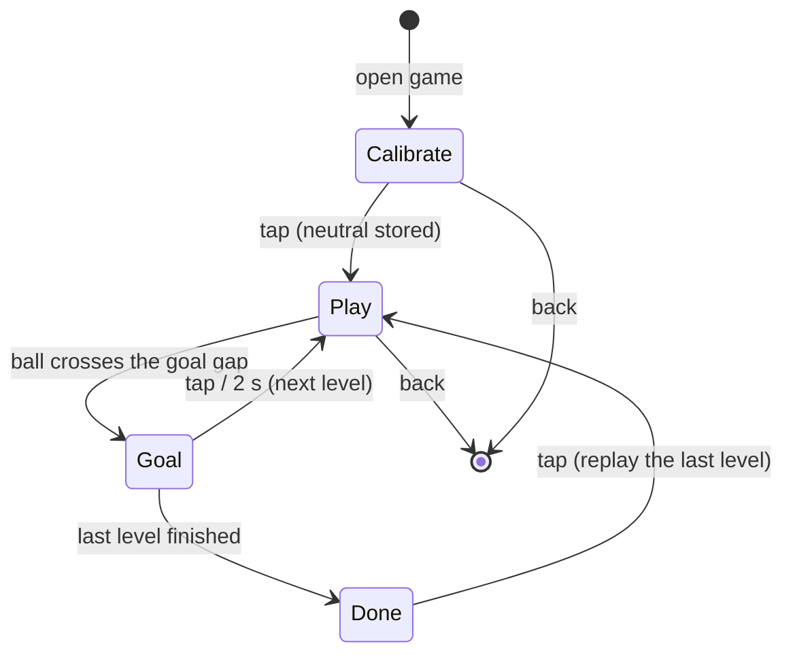

# Marble Kick: design

Status: draft for review, 2026-09-27. Built first; Tilt FC (`2026-09-27-tilt-fc-design.md`) comes second.
Concept canvas with research and mockups: https://claude.ai/artifact/QVizBtdL6G9X854bVxi32S

## What and why

A third Porthole game, and the smallest possible game about tilt: the round screen is a wooden labyrinth toy seen
from above, with a felt pitch inside. **Tilt the device and the ball rolls like a marble.** Roll it past slow wooden
pegs into the goal cut into the rim. Levels get harder with more pegs, then moving pegs, then pegs that drift toward
the ball.

It is built first for two reasons. It is the simplest of the concepts we liked. It also brings tilt input to the
runtime (driver, sim, scripts, web emulator) and answers the question the whole football direction depends on:
does tilt feel good for a 6-year-old holding the device in its case? Tilt FC reuses that input, not this game's code
or look.

Audience and constraints as in the Tilt FC spec: a 6-year-old, mid-first-grade English, a personal hand-sized device,
no other screen time.

## Product rules

- **Tilt is the only control in slices 1-2.** One tap arrives in slice 3 as a short kick, and never more than one.
  Difficulty grows from the pegs, never from the controls.
- **Neutral is how the kid holds the device.** The Calibrate page records the resting angle before each session.
- **Nothing punishes.** No timer, no holes, no lives, nothing takes the ball away. A peg only nudges the ball. A
  level is never failed, only not finished yet.
- **Its own look (root rule 7):** walnut rim, maple tray, green felt, red lacquered pegs, brass goalposts, Baloo 2
  for the few words. Drawn on the RGB565 surface in its own flat colors, sharing nothing with Pets Club, Biscuit or
  Tilt FC.
- **Sound:** none in slice 1. Later at most one short sound on a goal, through the shell's mute.

## Pages and states



- **Calibrate page:** "Hold me how you like, then tap." A bubble shows the current tilt so the kid sees it move.
- **Play page:** the tray, the pegs, the ball, the level number on a brass coin, the back button.
- **Goal page:** flags, "GOAL!", then the next level. Slice 4 adds a sticker here.
- **Done page:** shown after the last level of the current set: "You did them all!" (no score), tap to replay.
- Slice 3 adds a **Levels page** so the kid can replay any level already reached.

## Physics

Everything runs in native 480x480 pixels with floats (the S3 has an FPU), at a fixed 5 ms substep so a fast ball
cannot tunnel through a peg.

- **Tilt to acceleration:** subtract the calibrated neutral. Inside the dead zone (about 5 degrees, 87 mg) the
  acceleration is zero; it grows linearly to full at about 25 degrees (423 mg) and is clamped there. Felt friction
  damps the velocity every step. All of these are tuning constants in one header (`tune.h`), in the same spirit as
  `pet.h`.
- **Rim:** the pitch is a circle. The ball bounces off it with low restitution (about 0.4), except through the goal
  gap, an arc at the top.
- **Pegs:** circles. The ball is pushed out and reflected with restitution about 0.5. A moving peg adds its own
  velocity to the ball, which is how it "nudges".
- **Goal:** the ball's center crosses the rim inside the goal gap.
- **Pegs never trap the ball:** every level has a recorded solution (see Testing), and the level test proves that
  the ball can always reach the goal.

## Levels

A level is a constant table: ball start, goal gap (angle and width), pegs `{x, y, r, motion}` where motion is
`NONE`, `LINE(a, b, period)` or `DRIFT(speed)` (drift slowly toward the ball, slice 3). Slice 1 ships six static
levels:

1. empty pitch, just roll the ball in;
2. one peg in the way;
3. two pegs;
4. a wall of three pegs with a gap;
5. pegs guarding the goal mouth;
6. a slalom.

Slice 3 adds moving and drifting pegs and a one-tap kick, for 12+ levels in total.

## Architecture

### New: tilt in `Input` (os)

`os/input.h`'s `Input` gains three fields; nothing else in `os/` changes and the existing games ignore them:

```cpp
bool hasTilt = false;           // a sensor (or the sim) is supplying tilt
int16_t tiltX = 0, tiltY = 0;   // where a marble would roll, screen axes, milli-g: +x right, +y down the screen
```

Screen axes, not sensor axes: the firmware maps the QMI8658's axes to the panel's orientation once, so every game
reads "+y = toward the bottom of the screen". A game does its own calibration (subtracts the neutral it recorded);
the runtime stays dumb.

Sources of tilt:

- **Firmware (slice 2):** `board::readTilt()` reads the QMI8658 accelerometer over the shared I2C bus (GPIO15/7,
  alongside touch, expander and RTC) every frame, lightly low-pass filtered, and `main.cpp` copies it into `Input`.
  The I2C address and axis orientation are **unverified** until someone checks them on the board.
- **SDL sim:** arrow keys / WASD hold +/-400 mg per axis (diagonals allowed); release returns to 0.
- **Scripts (`snap --script`, playtests):** new command `tilt <x> <y>` sets a persistent tilt in milli-g.
- **Web emulator:** the `--serve` protocol gets a `tilt x y` line; `tools/webemu.py` sends it from arrow keys and
  from a small drag pad under the canvas.

### New: the game, `games/marble-kick/`

- `Game : App` with `surface()` = `SURFACE_RGB565`, `store()` = `"marblekick"`, screen names prefixed `mk_`.
- `physics.h` / `physics.cpp`: ball, rim, pegs, goal, tilt mapping. No drawing, so host tests can run it.
- `levels.h`: the level table. Array order is persisted (the save stores a level index), so levels are only ever
  appended, like Biscuit's story ids.
- `tune.h`: dead zone, full tilt, acceleration, friction, restitution.
- `render.cpp`: tray, felt, chalk lines, pegs with baked highlights and shadows, the ball, drawn with `gfx565`
  primitives (`circle`, `roundRect`, `rect`) plus an ellipse for shadows, kept inside the game until a second game
  needs it.
- Font: Baloo 2 (OFL), converted with the existing `fontconv.py` into the game's own `generated/fonts.h`, limited
  to the glyphs it draws. The launcher icon is a `gfx::Sprite` in the shared indexed palette, because the shell draws
  the launcher.
- Registered in `APPS[]` in `firmware/main.cpp` and `host/sim.cpp`.

### Save

`Save { magic, version, size, uint8_t level, crc }`: the highest level reached. It uses the usual header and is
append-only from its first shipped version. Later fields (stickers, best-run ghosts, levels made for someone else)
go before `crc` with a version bump.

## Slices

Each slice is playable end to end, has its own PR, and ends with `make ci` green.

| Slice | What ships | Where it runs | Size (provisional) |
| --- | --- | --- | --- |
| 1. Roll | Tilt in `Input` (sim keys, script `tilt`, webemu); the game registered; Calibrate, Play, Goal and Done pages; 6 static levels; level reached saved | emulator | feature, 2-3 days |
| 2. On the board | `board::readTilt()` for the QMI8658, axis mapping, filtering; tuning dead zone, acceleration and friction on the real device in its case; the kid plays it | device (firmware-engineer, needs the board) | story-to-feature, 1-2 days plus tuning |
| 3. Harder | moving and drifting pegs, the one-tap kick, 12+ levels, Levels page | emulator, then device | feature, 2-3 days |
| 4. Together | best-run ghost, a level made for someone else, stickers | emulator, then device | feature, 2-4 days |

Slice 2 depends only on slice 1's `Input` fields. It is the real test of the idea: if tilt feels bad in the case,
we learn it here, before Tilt FC.

## Testing

- `host/test_marble.cpp` (one `test_marble_SRC :=` line in the Makefile) over `physics.cpp` and `levels.h`:
  - tilt mapping: the dead zone, neutral subtraction, and clamping at full tilt;
  - the ball never leaves the circle except through the goal gap, even at maximum speed;
  - no tunneling through a peg at maximum speed;
  - goal detection;
  - save round trip, with a wrong crc or size rejected;
  - **every level is solvable:** each level has a recorded tilt sequence (its solution) and the test replays it to
    a goal. The same recordings later seed ghosts.
- `tests/playtests/marble_*.txt`: open the game, calibrate, `tilt` toward the goal, check `screen`, reach the Goal
  page, advance a level. The UI audit covers the back button and the Calibrate page.
- Coverage thresholds in the Makefile must not drop.
- A script tour cannot say whether tilt feels good. Slice 2 ends with the kid playing it on the device.

## Risks

- **Tilt fatigue and frustration.** Mitigations: the dead zone, the kid's own neutral, strong felt friction, short
  levels, no timer. The first real answer comes in slice 2.
- **Frame rate.** A full-screen RGB565 redraw every frame writes 460 KB to PSRAM per frame. Unlike Tilt FC, nothing
  scrolls here, so if it is too slow the static tray can be drawn once and only the ball and pegs redrawn.
- **Unverified hardware facts:** the QMI8658's I2C address and its axis orientation relative to the panel.
- **Taps near the rim while tilting:** a hand holding the case may touch the glass. Play ignores taps (slices 1-2),
  except for the back button.

## Out of scope

Holes, timers, lives, scores, levels that can be failed, network, and anything that makes time away cost something.
