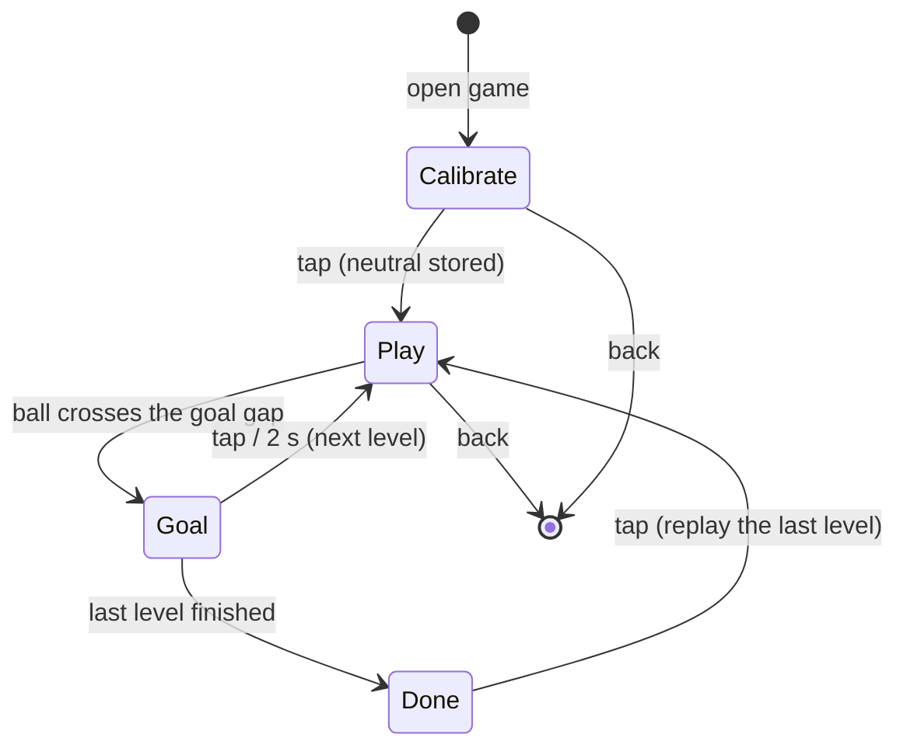

# Marble Kick: design

Status: draft for review, 2026-09-27. Built first; Tilt FC (`2026-09-27-tilt-fc-design.md`) comes second.
Concept canvas with research and mockups: https://claude.ai/artifact/QVizBtdL6G9X854bVxi32S

## What and why

A third Porthole game, and the smallest possible game about tilt: the round screen is a wooden labyrinth toy seen
from above, with a felt pitch inside. **Tilt the device and the ball rolls like a marble.** Roll it past slow wooden
pegs into the goal cut into the rim. Levels get harder with more pegs, then moving pegs, then pegs that drift toward
the ball.

It is built first for two reasons. It is the simplest of the concepts we liked, and, on top of the shared tilt input
(built with the Sand Jar session), it answers the question the whole football direction depends on:
does tilt feel good for a 6-year-old holding the device in its case? Tilt FC reuses that input, not this game's code
or look.

Audience and constraints as in the Tilt FC spec: a 6-year-old, mid-first-grade English, a personal hand-sized device,
no other screen time.

## Product rules

- **Tilt is the only control in slices 1-2.** One tap arrives in slice 3 as a short kick, and never more than one.
  Difficulty grows from the pegs, never from the controls.
- **Neutral is how the kid holds the device.** The Calibrate page records the resting angle before each session.
- **A puzzle, not a funnel.** Playing the first build showed that tilting straight at the goal and waiting won every
  level. From level 3 on a greedy tilt at the goal must not score: walls and cups make the kid go round, holes sit
  on the straight line, and a keeper and a moving goal want timing. Three optional stars per level reward the long
  way round.
- **Nothing punishes.** No timer, no lives, no score. A peg only nudges the ball; a hole sinks it and puts it back
  at the level's start a second later, keeping the stars already picked up. A level is never failed, only not
  finished yet.
- **Its own look (root rule 7):** walnut rim, maple tray, green felt, red lacquered pegs, brass goalposts, wooden
  letter blocks for the few words. Drawn on the RGB565 surface in its own flat colors, sharing nothing with Pets Club, Biscuit or
  Tilt FC.
- **Sound:** none in slice 1. Later at most one short sound on a goal, through the shell's mute.

## Pages and states

- **Calibrate page:** "Hold me how you like, then tap." A bubble shows the current tilt so the kid sees it move.
- **Play page:** the tray, the pegs, the ball, the level number on a brass coin, the back button.
- **Goal page:** flags, "GOAL!", then the next level. Slice 4 adds a sticker here.
- **Done page:** shown after the last level: confetti, then a coin per level with its best stars; a coin replays
  that level.
- Slice 3 adds a **Levels page** so the kid can replay any level already reached.

## Physics

Everything runs in native 480x480 pixels with floats (the S3 has an FPU), at a fixed 5 ms substep so a fast ball
cannot tunnel through a peg.

- **Tilt to acceleration:** subtract the calibrated neutral. Inside the dead zone (about 5 degrees, 87 mg) the
  acceleration is zero; it grows linearly to full at about 25 degrees (423 mg) and is clamped there. Felt friction
  damps the velocity every step. All of these are tuning constants in one header (`tune.h`), in the same spirit as
  `pet.h`.
- **Rim:** the pitch is a circle. The ball bounces off it with low restitution (about 0.4), except through the goal
  gap, an arc at the top.
- **Pegs:** circles. The ball is pushed out and reflected with restitution about 0.5. A moving peg adds its own
  velocity to the ball, which is how it "nudges".
- **Goal:** the ball's center crosses the rim inside the goal gap.
- **Pegs never trap the ball:** every level has a recorded solution (see Testing), and the level test proves that
  the ball can always reach the goal.

## Levels

A level is a constant table: ball start, goal width and motion (`FIXED`, `SPIN` turning back every period, or
`SWING` between two angles), pegs (static, a defender pacing a line, or the keeper across the mouth), rails
(capsule walls), holes, three stars and a recorded solution. Twelve levels ship, ramped: 1-2 teach tilting, 3-4 walls
and detours (the first hole), 5-6 defenders, 7-8 the keeper and a swinging goal, 9-12 everything together. The level
list, geometry rules and per-level greedy results live in `games/marble-kick/CLAUDE.md` and `levels.h`.

Slice 3 adds drifting pegs, the one-tap kick and a Levels page.

## Architecture

### Tilt input (shared platform, `feat/motion-sensor`)

Built together with the Sand Jar session on the shared branch `feat/motion-sensor`, not by this game:

- `Input.gx/gy/gz`: gravity (where things fall) in milli-g, screen frame: +x right, +y toward the bottom edge, +z out
  of the glass. Upright (0, 1000, 0), lying face up (0, 0, -1000); the default (0, 0, -1000) means no in-plane tilt.
- Firmware: `board::readAccel()` for the QMI8658 (I2C 0x6B, WHO_AM_I 0x05, +/-4 g, 224 Hz, ~30 Hz low-pass), read
  once per frame, verified on the board except the x/y axis mapping (`SCREEN_FROM_CHIP` in `firmware/board.cpp`).
  Serial `A` (reading), `G<x>,<y>,<z>` (override), `M` (frame metrics); `tools/devctl.py tilt/untilt/metrics`.
- Sim: script and `--serve` command `tilt X Y Z`, `shake`, `perf`; SDL arrow keys turn and lay the device; the web
  emulator has a tilt pad. The sim holds the device upright (0, 1000, 0) until told otherwise.

Marble Kick's own part: the Calibrate page stores the gravity vector the kid holds as neutral, and each frame the
in-plane tilt is `(gx - neutral.gx, gy - neutral.gy)`, then the dead zone and the clamp.

### New: the game, `games/marble-kick/`

- `Game : App` with `surface()` = `SURFACE_RGB565`, `store()` = `"marblekick"`, screen names prefixed `mk_`.
- `physics.h` / `physics.cpp`: ball, rim, pegs, goal, tilt mapping. No drawing, so host tests can run it.
- `levels.h`: the level table. Array order is persisted (the save stores a level index), so levels are only ever
  appended, like Biscuit's story ids.
- `tune.h`: dead zone, full tilt, acceleration, friction, restitution.
- `render.cpp`: tray, felt, chalk lines, pegs with baked highlights and shadows, the ball, drawn with `gfx565`
  primitives (`circle`, `roundRect`, `rect`) plus an ellipse for shadows, kept inside the game until a second game
  needs it.
- Lettering: wooden letter blocks drawn in code (rounded cells, one glyph per block) for the few glyphs the game
  shows (digits, GOAL!). No font file, so nothing to fetch, and a look no other game has. The launcher icon is a `gfx::Sprite` in the shared indexed palette, because the shell draws
  the launcher.
- Registered in `APPS[]` in `firmware/main.cpp` and `host/sim.cpp`.

### Save

`Save { magic, version, size, uint8_t level, crc }`: the highest level reached. It uses the usual header and is
append-only from its first shipped version. Later fields (stickers, best-run ghosts, levels made for someone else)
go before `crc` with a version bump.

## Slices

Each slice is playable end to end, has its own PR, and ends with `make ci` green.

| Slice | What ships | Where it runs | Size (provisional) |
| --- | --- | --- | --- |
| 1. Roll | The game registered; Calibrate, Play, Goal and Done pages; 6 static levels; level reached saved | emulator | feature, 2-3 days |
| 2. On the board | Settle the x/y axis mapping with one physical tilt; tune dead zone, acceleration and friction on the real device in its case; the kid plays it | device (shared with the Sand Jar session) | story, 1 day plus tuning |
| 3. Harder | drifting pegs, the one-tap kick, Levels page (walls, holes, defenders, keeper, moving goals, stars and 12 levels landed early, after the first play felt too easy) | emulator, then device | feature, 1-2 days |
| 4. Together | best-run ghost, a level made for someone else, stickers | emulator, then device | feature, 2-4 days |

Slice 2 is the real test of the idea: if tilt feels bad in the case,
we learn it here, before Tilt FC.

## Testing

- `host/test_marble.cpp` (one `test_marble_SRC :=` line in the Makefile) over `physics.cpp` and `levels.h`:
  - tilt mapping: the dead zone, neutral subtraction, and clamping at full tilt;
  - the ball never leaves the circle except through the goal gap, even at maximum speed;
  - no tunneling through a peg at maximum speed;
  - goal detection;
  - save round trip, with a wrong crc or size rejected;
  - **every level is solvable:** each level has a recorded tilt sequence (its solution) and the test replays it to
    a goal. The same recordings later seed ghosts.
- `tests/playtests/marble_*.txt`: open the game, calibrate, `tilt` toward the goal, check `screen`, reach the Goal
  page, advance a level. The UI audit covers the back button and the Calibrate page.
- Coverage thresholds in the Makefile must not drop.
- A script tour cannot say whether tilt feels good. Slice 2 ends with the kid playing it on the device.

## Risks

- **Tilt fatigue and frustration.** Mitigations: the dead zone, the kid's own neutral, strong felt friction, short
  levels, no timer. The first real answer comes in slice 2.
- **Frame rate.** Measured on the board by the Sand Jar session: a full 480x480 RGB565 redraw takes ~24 ms and
  Biscuit runs ~19.5 fps. The panel has two buffers used by turns, so Marble Kick redraws only what changed (the
  ball, moving pegs, their old spots) in each buffer, tracking two frames of dirty rectangles.
- **Unverified hardware fact:** the x/y axis mapping of the QMI8658 relative to the panel.
- **Taps near the rim while tilting:** a hand holding the case may touch the glass. Play ignores taps (slices 1-2),
  except for the back button.

## Out of scope

Timers, lives, scores, levels that can be failed, network, and anything that makes time away cost something.
