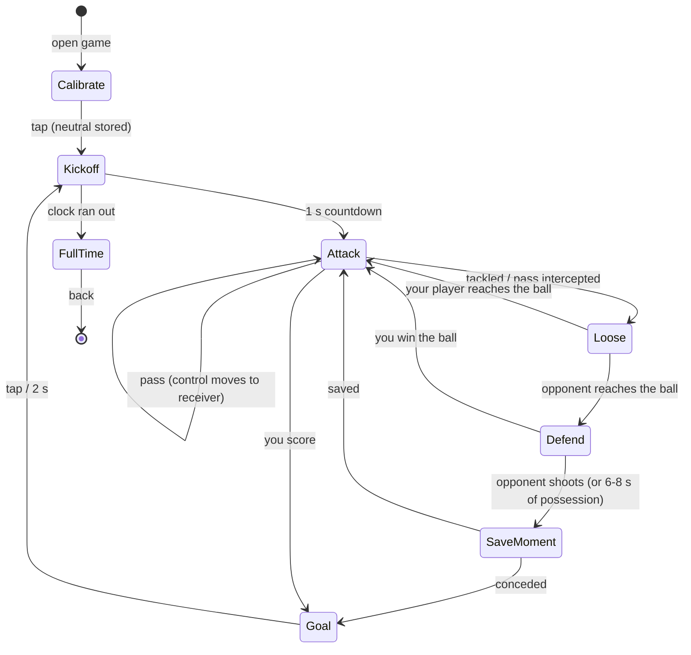

# Tilt FC: design

Status: draft for review, 2026-09-27. Concept canvas (research, mockups, the three concepts we did not pick):
https://claude.ai/artifact/QVizBtdL6G9X854bVxi32S

## What and why

A third Porthole game: top-down street football where **tilting the device steers the player with the ball and a
tap anywhere passes or shoots**. It is FIFA with the gamepad replaced by the device itself. It was picked from four
concepts for a 6-year-old who plays chess and card games, likes Pokemon and Minecraft, reads English at a
mid-first-grade level, and has no other screen time. The device lives in a hand-sized case. It is a personal toy:
"playing together" means taking turns, never passing the device mid-match.

Research found no shipped game that steers a footballer by tilt. The control scheme is new, so the first builds
exist to find out whether it is fun in a 6-year-old's hands, and every slice has to be playable end to end.

## Product rules

On top of the shared app brief (round screen, 8 mm targets, rare sound, append-only saves, nothing punishes):

- **Two inputs for the whole game: tilt and tap.** No swipes, zones or on-screen buttons during play. The only
  button in a match is the back button.
- **Tilt sets direction, never speed.** Players run at a fixed speed, so the kid never has to hold a precise
  angle. Dead zone about 5 degrees, full direction about 25 degrees past neutral. Both are tuning constants.
- **Neutral is how the kid holds the device, not flat.** The Calibrate page records the resting angle before
  each match.
- **Nothing punishes.** There are no fouls or cards, a missed tackle costs half a second, and a lost match still
  earns a sticker (slice 4). No timers apart from the match clock, and the clock never ends a match badly: the
  full-time whistle just shows the score.
- **Its own look (root rule 7).** Sunny street court, chalk lines, long shadows, teal against coral, Rubik Mono One
  for the few words. Nothing is borrowed from Pets Club or Biscuit. Drawn on the RGB565 surface with its own flat
  colors.

## Controls

| Situation | Tilt | Tap anywhere |
| --- | --- | --- |
| You have the ball | your player runs that way, ball at his feet | pass along the tilt direction (auto-targets a teammate in a +/-30 degree cone); if the goal is in the cone and in range, shoot; if nobody is in the cone, the ball rolls ahead |
| Teammate has the ball (just passed) | control has already switched to the receiver | as above |
| Opponent has the ball (slice 2) | control is on your player nearest the ball; run at the carrier | slide tackle along the tilt direction; running into the carrier also knocks the ball loose |
| Shot at your goal (slice 2) | keeper dives with a sharp tilt | keeper dives toward the tap side |

Defense is taken from Sensible Soccer and FIFA's Two-Button mode (control switches to the nearest player
automatically, the same button changes meaning with possession), Mario Strikers (no fouls), and Retro Goal
(fallback: no defense at all, the opponent's attack plays as a short highlight that ends in a keeper moment).

## Pages and states



Pages the kid sees: **Calibrate page**, **Kickoff page**, **Match page** (Attack, Loose and Defend are states of
this one page), **Save moment** (slow motion inside the Match page), **Goal page**, **Full time page**. The back
button on every page leads out (Match page asks nothing, it just leaves; the match is not saved in slice 1).

## Architecture

### New: tilt in `Input` (os)

`os/input.h`'s `Input` gains three fields; nothing else in `os/` changes and the existing games ignore them:

```cpp
bool hasTilt = false;       // a sensor (or the sim) is supplying tilt
int16_t tiltX = 0, tiltY = 0;   // where a marble would roll, screen axes, milli-g: +x right, +y down the screen
```

Screen axes, not sensor axes: the firmware maps the QMI8658's axes to the panel's orientation once, so every game
reads "+y = toward the bottom of the screen". A game does its own calibration (subtracts the neutral it
recorded); the runtime stays dumb.

Sources of tilt:

- **Firmware:** `board::readTilt()` reads the QMI8658 accelerometer over the shared I2C bus (GPIO15/7, alongside
  touch, expander and RTC) every frame, lightly low-pass filtered, and `main.cpp` copies it into `Input`.
  The I2C address and axis orientation are **unverified** until someone checks them on the board.
- **SDL sim:** arrow keys / WASD hold +/-600 mg per axis (diagonals allowed); release returns to 0.
- **Scripts (`snap --script`, playtests):** new command `tilt <x> <y>` sets a persistent tilt in milli-g.
- **Web emulator:** the `--serve` protocol gets a `tilt x y` line; `tools/webemu.py` sends it from arrow keys and
  from a small drag pad under the canvas.

### New: the game, `games/tilt-fc/`

- `Game : App` with `surface()` = `SURFACE_RGB565`, `store()` = `"tiltfc"`, screen names prefixed `fc_`.
- `match.h` / `match.cpp`: the pure rules, no drawing: positions and velocities in court units (floats; the S3 has
  an FPU), possession, control switching, pass targeting, shooting, tackles, the opponent AI, the match clock.
  Everything a host test needs lives here.
- `render.cpp`: the court, players, ball, cone and rim markers, drawn with `gfx565` primitives plus the few the
  game needs that `gfx565` lacks (ellipse, thick line, filled triangle). They stay in the game until a second game
  needs them.
- Camera follows the ball with smoothing, clamped to the court. The court is about 2 screens wide and 3 tall.
  Rim markers (triangles on the circle's edge) point at the goal and at off-screen teammates.
- Font: Rubik Mono One (OFL), converted with the existing `fontconv.py` into the game's own `generated/fonts.h`,
  limited to the glyphs the game draws. Reusing the tool is fine, sharing the font is not.
- Registered in `APPS[]` in both `firmware/main.cpp` and `host/sim.cpp`. The launcher icon is a `gfx::Sprite`
  in the shared indexed palette, because the launcher (shell UI) draws it.
- Sound: none in slices 1-2. Later at most one short goal sound, through the shell's mute.

### Save

Slice 1 saves nothing (`takeSave` returns false). Slice 4 adds a `Save` with the usual magic/version/size/crc
header: kit colors, pattern, number, sticker bits, records. It is append-only from its first shipped version.
Challenges for "together, taking turns" live in the challenger's own save, and others read them through
`AppEnter.saves` (the Paw Street pattern). Nobody writes someone else's save.

## Slices

Each slice is playable end to end, has its own PR, and ends with `make ci` green.

| Slice | What ships | Where it runs | Size (provisional) |
| --- | --- | --- | --- |
| 1. Kickabout | Tilt in `Input` (sim keys, script `tilt`, webemu); the game registered; Calibrate/Kickoff/Match/Goal pages; you + 1 teammate + a keeper who only stands and blocks; pass-to-cone, control switch, shot, goal, kickoff | emulator | feature, 2-4 days |
| 2. Match | 3 v 3 (two outfield players and a keeper each); defense as above; 6-8 s possession cap; Save moment; match clock; Full time page | emulator | feature, 3-5 days |
| 3. On the board | `board::readTilt()` for the QMI8658, axis mapping, filtering; tuning dead zone, speed and cone on the real device in its case | device (firmware-engineer, needs the board) | story-to-feature, 1-2 days plus tuning |
| 4. Own team | Kit, Pattern and Number pages; stickers and album; records and ghosts for taking turns | emulator, then device | feature, 2-4 days |

Slice 3 depends only on slice 1's `Input` fields, so it can run in parallel with slice 2 once slice 1 merges.
The overall shape is an epic: about 1-2 weeks of agent-assisted work, with calendar time dominated by tuning on the
device.

## Testing

- `host/test_tiltfc.cpp` (one `test_tiltfc_SRC :=` line in the Makefile) over `match.cpp`: pass targeting
  (nearest-by-angle inside the cone, nobody in the cone, goal in the cone vs out of range), control switching on
  pass and on possession change, dead zone and neutral subtraction, goal detection and kickoff reset, and in
  slice 2 the tackle and possession-cap rules. It stays deterministic by seeding the AI and fixing the timestep.
- `tests/playtests/tiltfc_*.txt`: open the game, calibrate, `tilt` toward a teammate, tap, check `screen` and
  `debug` output, score, reach the Full time page (slice 2). The UI audit covers the back button and any page
  buttons.
- Coverage thresholds in the Makefile must not drop. The new code carries its own tests.
- Every gameplay change is verified with a script tour and screenshots before it is called done. A tour cannot say
  whether tilt feels good, so slice 3 ends with the kid playing it.

## Risks

- **Continuous tilt is exactly what Switch Sports players complained about.** Mitigations: direction-only tilt,
  fixed speed, slow pace, short matches, calibration to the kid's own resting angle. If it still frustrates him, an
  "Easy" mode lets teammates move themselves more.
- **Tilt also chooses the pass direction.** If aiming with the same tilt that steers the runner confuses him, the
  pass follows the running direction instead, and a standing player passes to the nearest teammate.
- **A third of the court on screen.** Rim markers and camera lead are the answer. If they are not enough, a
  zoomed-out court.
- **Frame rate.** A scrolling full-screen RGB565 redraw every frame writes 460 KB to PSRAM per frame. It is
  unmeasured on this board. If it is too slow: redraw only dirty regions over a cached court tile.
- **Unverified hardware facts:** the QMI8658's I2C address and its axis orientation relative to the panel.

## Out of scope

Live two-device play over Bluetooth, network, a pixel crest editor, currencies, streaks, and anything that makes
time away cost something.
