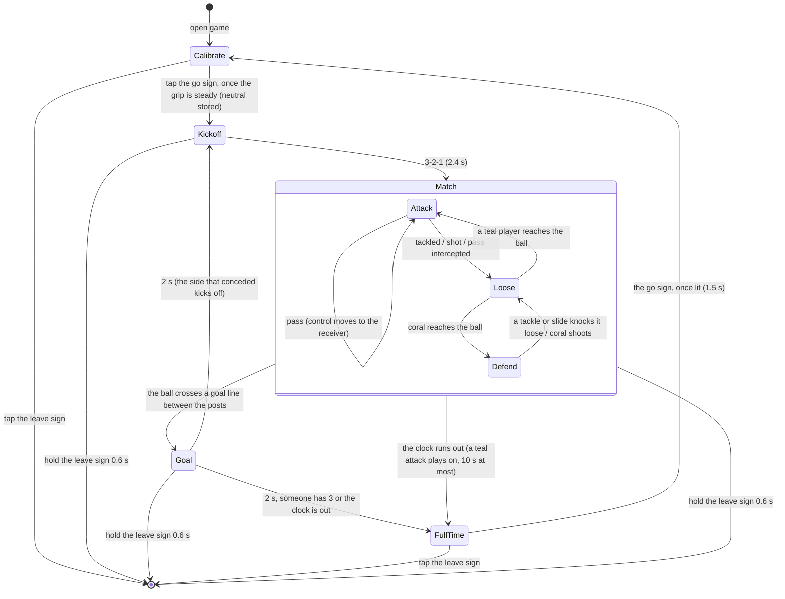

# Tilt FC: design

Status: slice 1 built, 2026-09-27 (`apps/porthole/games/tilt-fc/`), with the defense and full match the table below
first put in slice 2: see "Slice 1 as built". Built after Marble Kick. Concept canvas (research, mockups, the other concepts):
https://claude.ai/artifact/QVizBtdL6G9X854bVxi32S

## What and why

A third Porthole game: top-down street football where **tilting the device steers the player with the ball and a
tap anywhere passes or shoots**. It is FIFA with the gamepad replaced by the device itself. It was picked from four
concepts for a 6-year-old who plays chess and card games, likes Pokemon and Minecraft, reads English at a
mid-first-grade level, and has no other screen time. The device lives in a hand-sized case. It is a personal toy:
"playing together" means taking turns, never passing the device mid-match.

Research found no shipped game that steers a footballer by tilt. The control scheme is new, so the first builds
exist to find out whether it is fun in a 6-year-old's hands, and every slice has to be playable end to end.

## Product rules

On top of the shared app brief (round screen, 8 mm targets, rare sound, append-only saves, nothing punishes):

- **Two inputs for the whole game: tilt and tap.** No swipes, zones or on-screen buttons during play. The only
  button in a match is the back button.
- **Tilt sets direction, never speed.** Players run at a fixed speed, so the kid never has to hold a precise
  angle. Dead zone about 5 degrees (`DEAD_MG`, a tuning constant). Past it the tilt is a direction only, so there is
  no "full tilt" angle: a 6 degree tilt and a 40 degree one run the same way at the same speed.
- **Neutral is how the kid holds the device, not flat.** The Calibrate page records the resting angle before
  each match.
- **Nothing punishes.** There are no fouls or cards, a missed tackle costs half a second, and a lost match still
  earns a sticker (slice 4). No timers apart from the match clock, and the clock never ends a match badly: the
  full-time whistle just shows the score.
- **Its own look (root rule 7).** Sunny street court, chalk lines, long shadows, teal against coral, Rubik Mono One
  for the few words. Nothing is borrowed from Pets Club or Biscuit. Drawn on the RGB565 surface with its own flat
  colors.

## Controls

| Situation | Tilt | Tap anywhere |
| --- | --- | --- |
| You have the ball | your player runs that way, ball at his feet | pass along the tilt direction (auto-targets a teammate in a +/-30 degree cone); if the goal is in the cone and in range, shoot; if nobody is in the cone, the ball rolls ahead |
| Teammate has the ball (just passed) | control has already switched to the receiver | as above |
| Opponent has the ball (slice 1) | control is on your player nearest the ball; run at the carrier | slide tackle along the tilt direction; running into the carrier also knocks the ball loose |
| Shot at your goal (later) | keeper dives with a sharp tilt | keeper dives toward the tap side |

Defense is taken from Sensible Soccer and FIFA's Two-Button mode (control switches to the nearest player
automatically, the same button changes meaning with possession), Mario Strikers (no fouls), and Retro Goal
(fallback: no defense at all, the opponent's attack plays as a short highlight that ends in a keeper moment).

## Pages and states

As built in slice 1 (the Save moment is still to come):

Pages the kid sees: **Calibrate page**, **Kickoff page**, **Match page** (Attack, Loose and Defend are states of
this one page), **Goal page**, **Full time page**. The leave sign on every page leads out: a tap (or a long press let
go on it) on the Calibrate and Full time pages, a 0.6 s hold on the Kickoff, Match and Goal pages (a hand on the case
brushes the glass). The match in progress is not saved; the result is (wins and the next level), the moment the match
is decided.

## Architecture

### Tilt input (lands with Marble Kick)

Tilt input is shared platform (`Input.gx/gy/gz`, the QMI8658 driver, tilt in the sim, scripts and web emulator),
built with the Sand Jar session on `feat/motion-sensor`. See
`docs/superpowers/specs/2026-09-27-marble-kick-design.md`. Tilt FC only consumes it. Since Tilt FC, the tilt away
from the kid's resting angle and the steady neutral are shared too (`os/tilt.h`); what a tilt does stays per game.

### New: the game, `games/tilt-fc/`

- `Game : App` with `surface()` = `SURFACE_RGB565`, `store()` = `"tiltfc"`, screen names prefixed `fc_`.
- `match.h` / `match.cpp`: the pure rules, no drawing: positions and velocities in court units (floats; the S3 has
  an FPU), possession, control switching, pass targeting, shooting, tackles, the opponent AI, the match clock.
  Everything a host test needs lives here.
- `render.cpp`: the court, players, ball and markers, drawn in code on the runtime's clipped span painter
  (`os/canvas.h`: spans, discs, convex polygons, round boxes, and the two-buffer repaint bookkeeping), which Marble
  Kick and Tilt FC share; only the look is the game's.
- ~~Camera follows the ball; the court is about 2 screens wide and 3 tall; rim markers point off screen.~~ Decided
  against in slice 1: the court fits one round screen (see "Slice 1 as built"), so there is no camera and nothing is
  ever off screen.
- Font: Rubik Mono One (OFL; the TTF and its `OFL.txt` in `games/tilt-fc/fonts/`), converted with the existing
  `fontconv.py --game tiltfc` into the game's own `generated/fonts.h` at 18, 36 and 64 px, with bitmaps only for the
  glyphs the game draws (" !0123456789AGLO"). Reusing the tool is fine, sharing the font is not.
- Registered in `APPS[]` in both `firmware/main.cpp` and `host/sim.cpp`. The launcher icon is a `gfx::Sprite`
  in the shared indexed palette, because the launcher (shell UI) draws it.
- Sound: none in slices 1-2. Later at most one short goal sound, through the shell's mute.

### Save

Slice 1 saves a 16-byte v1 `Save` with the usual magic/version/size/crc header: matches won and the difficulty
level they earned (a reason to come back, and the ramp). Slice 4 appends kit colors, pattern, number, sticker bits,
records. It is append-only from its first shipped version.
Challenges for "together, taking turns" live in the challenger's own save, and others read them through
`AppEnter.saves` (the Paw Street pattern). Nobody writes someone else's save.

## Real teams and numbers (slice 4)

The kit is a small window onto real football, since the kid watches none on TV. The Team page flips through real
home kits with the team's name and flag: **USA, Ukraine and Argentina are required**; Mexico, Brazil, France, Spain,
Real Madrid, Barcelona and Inter Miami are candidates. The last entry, "My colors", opens the custom Kit and Pattern
pages. On the Number page a number that a famous player wears for the chosen team shows his name under the shirt
(Argentina 10: MESSI, the kid's favorite).

- Every (team, number, player) triple and every kit color is a factual claim. Each one gets a source and an "as of
  season" date in a claim ledger, the way Biscuit's discoveries do, and is rechecked each season. A triple without
  a source is left out: no hint is better than a wrong one.
- Names and colors only: no crests, logos, photos or faces. Flags and kits are drawn in the game's own style.
  Names in uppercase ASCII without diacritics, within the game's font.
- The root rule "no real names" is about the kids' data. Public footballers' names are content, not personal data.
- Everything ships in the firmware; there is no network.

## Slices

Each slice is playable end to end, has its own PR, and ends with `make ci` green.

| Slice | What ships | Where it runs | Size (provisional) |
| --- | --- | --- | --- |
| 1. Match (built) | The game registered; Calibrate/Kickoff/Match/Goal/Full time pages; 2 v 2 plus keepers: pass-to-cone, control switch, shot, slide tackle, knock-loose steals, coral pressing and lane blocking, keepers covering the shot; first to 3 or 3 minutes; five difficulty levels; a v1 save (wins, level); `os/tilt.h` shared with Marble Kick | emulator | feature, done |
| 2. Keeper moments | Save moment (slow motion, the kid's keeper dives by tilt or tap); rim-side cheer; possession cap tuning | emulator | story, 1-2 days |
| 3. On the board | Measuring the frame rate; tuning dead zone, speeds, cone and the levels on the real device in its case, with the kid | device | story, 1 day plus tuning |
| 4. Own team | Team page (real national teams and clubs), Kit and Pattern pages for custom colors, Number page with the famous player for that team and number; stickers and album; records and ghosts for taking turns | emulator, then device | feature, 2-4 days |

## Slice 1 as built

Decisions made where this spec was open, and why.

- **One screen, no camera.** The court is a round-cornered rectangle 300 x 380 px that fits the round glass, goals
  at the top and bottom, the scoreboard and the leave sign in the paving either side. Readable for a 6-year-old:
  every player, both goals and the passing lanes are always in view, so there are no rim markers to learn, and
  "pass around the defender" is something he can see. Cheap to draw: with no scrolling, a frame repaints only what
  moved (Marble Kick's technique, which runs at 55 fps on the board); a full repaint happens only on a page change or
  a change of the scoreboard, the countdown or the hold ring. On the host a full repaint costs about half Marble
  Kick's and a playing frame about a quarter; the board is not measured yet (slice 3). The cost: players are small
  (34 px, about 4 mm) with 18 px shirt numbers.
- **First to three goals, or three minutes.** First-to-three makes every goal matter and ends a lopsided match fast
  (a 0-3 loss is over in about a minute, not dragged out); the three-minute clock stops a tight 0-0 before it
  outlasts a 6-year-old's attention. The clock is a chalk dial between the scores, no numbers. At the whistle a teal
  attack plays on for up to 10 s, so the clock never takes a chance away from the kid.
- **The opponents defend from the first match** (the lesson of Marble Kick's first build: tilting straight at the
  goal was no game). Coral's outfield pair: the one nearer the ball presses it, the other stands in the lane from
  the carrier to his partner (or between a loose ball and their goal). They run slower than the kid's player and
  turn with weight, so a sidestep beats them. With the ball they head for a spot in front of the goal, bend away from
  a defender (keeper included), pass when pressed and the lane is open, and shoot in range or after 6 s. Keepers
  stay on their line, level with the ball, and move for a shot only after a reaction time drawn fresh for every kick,
  so a save is a chance, not a certainty. A keeper holding the ball gets room (opponents kept 80 px away) and throws
  to a teammate with an open lane and room up the court from him (never back toward his own line: a throw to the kid
  running behind his keeper once went in), else rolls it out wide.
- **Steals without fouls.** Touching the ball an opponent carries knocks it loose (softly, so it stays near the
  tackler); the carrier cannot take it straight back for half a second. The kid's slide reaches a little further; a
  slide that wins nothing costs half a second.
- **Kickoff rule.** At every kickoff the side not on the ball waits outside the centre circle until the ball leaves
  the spot, for 3 s at most, so a kid still finding his grip is not robbed on the spot.
- **A kid's taps and presses.** Kickoff, Match and Goal are one court: no fresh-page pause between them, so the first
  tap of a match plays, and a hold on the leave sign carries on across them; the hold counts from when the finger is
  on the sign, so drifting off and back starts it over. The 3-2-1 takes 0.8 s a digit. Mashing skips nothing: the
  Goal page ignores taps for its 2 s, and Full time (an empty court, the cup, the two score tiles) moves on only by
  its go sign, unlit for the first 1.5 s (a press that went down on it unlit never counts). Signs off the court take a tap or a long press let go on them. A tap held
  level with the ball and nobody that way passes to the teammate (at a teal kickoff it used to roll up to coral).
  Big words sit on a street-name plate so they read over any player.
- **Difficulty.** Five levels (`tune.h`): coral's speed and turning, their keeper's speed and reaction, the speed and
  accuracy of their shots. A win moves up one, a loss by two or more down one; the kid's own keeper does not get
  better or worse.
- **Control.** The kid steers the teal player with the ball, the one a teal pass is heading to (who runs to meet it
  by himself, so the tilt that aimed the pass does not run him away from it), or else the one nearer the ball by a
  30 px margin, so control does not flicker between two players level with it.

The challenge test (`host/test_tiltfc.cpp`, thirty seeded matches per way of playing per level; bots decide once per
40 ms frame). Greedy: straight at the goal's middle with the ball, shoot when that shoots. Passing: with a defender
close ahead, pass when the teammate's lane is clear, else go round him; from closer in, shoot for the corner the
keeper is not in. Idle: no tilt, no taps. Both active bots defend the same way (chase the ball, slide when close).

| Level | Greedy: goals for-against a match, wins of 30 | Passing: goals, wins of 30 | Idle: goals against a match, first after (mean, soonest) |
| --- | --- | --- | --- |
| 0 | 0.30-1.37, 3 | 3.00-0.00, 30 | 0.17, 157 s, 5.7 s |
| 1 | 0.33-1.87, 1 | 3.00-0.00, 30 | 0.27, 148 s, 5.5 s |
| 2 | 0.03-2.53, 1 | 3.00-0.63, 30 | 0.77, 113 s, 5.4 s |
| 3 | 0.03-2.87, 0 | 2.97-1.23, 29 | 1.20, 77 s, 5.3 s |
| 4 | 0.00-2.97, 0 | 2.70-1.50, 23 | 2.57, 30 s, 5.2 s |

Every host build computes plain IEEE floats (`-ffp-contract=off` in the Makefile): Apple clang fuses `a*b+c` into
one FMA by default and gcc on x86 does not, and the same seeds came out differently in the hook and in CI (greedy's
level-0 wins 1 against 3). The table is from the strict build, the same under clang and g++.

The bounds the test holds at every level, set from the design rather than these numbers: passing scores at least
twice what greedy does and 1.5 goals a match more; greedy wins at most one match in five (6 of 30, the design's
limit); passing wins at least half; an idle player is not scored on before 4.5 s (the kickoff wait plus 1.5 s) and on
average not before 20 s. From one level to the next, passing wins at most two more and an idle player is scored on at
most 0.1 a match less (thirty seeds are noisy); the top level against the first is the strict check: passing wins
fewer there, and an idle player is scored on more.

The levels were tuned (coral's speed, turning and shots, their keeper) against those bounds on 180 seeds in windows of
thirty, not just the test's thirty. Rerun in the strict build: greedy won at most 5 of 30 in any window (level 0; 13
of 180 there, about one in fourteen), passing never won more at a level than at the one before, an idle player was
never scored on first before 24 s on average, and idle's goals against rose level by level in every window but two
(0.03 goal dips, between levels 0 and 1 and between 1 and 2). Greedy's goals at level 0 are central shots that slip
past the keeper now and then, one every three to ten matches: a new kid scores rarely until he aims for a corner or
passes. The earlier tuning let greedy win 6 of 30 at level 1, on the bound, and levels
2-4 were not in order. The ladder is sensitive at the top: coral's level-4 speed at 112 instead of 114 drops the
passing bot from about 23 wins of 30 to 9, so retune level 4 in small steps and rerun the test.

## Testing

- `host/test_tiltfc.cpp` (one `test_tiltfc_SRC :=` line in the Makefile) over `match.cpp` and the game: pass
  targeting (nearest-by-angle inside the cone, nobody in the cone, goal in the cone vs out of range), control
  switching on pass and on possession change, dead zone and neutral subtraction from three grips, goal detection and
  kickoff reset, tackles, slides and the keeper's room, the whistle, the kickoff wait, the challenge (above), the save
  and the level it carries, every drawn string in the font, and every incrementally drawn frame equal to a full
  repaint. It stays deterministic by seeding the AI and fixing the timestep. `host/test_tilt.cpp` covers `os/tilt.h`.
- `tests/playtests/60_tiltfc_*.txt` to `64_tiltfc_*.txt`: calibrate (with a jolt), leave by hold and by tap, a
  recorded match to a goal from upright and one to Full time from a 45 degree grip (the passing bot's moves as `tilt`,
  `wait` and `tap` lines, written by `build/host/test_tiltfc --write-playtests` and checked by the test), the whistle,
  the saved level, `ui-check` on every page, a monkey under ASan, and a 6-year-old's taps (through the 3-2-1, the first
  tap of the match, drifting on and off the leave sign, mashing Full time, a hold from the 3-2-1 into the match).
- Coverage thresholds in the Makefile must not drop. The new code carries its own tests.
- Every gameplay change is verified with a script tour and screenshots before it is called done. A tour cannot say
  whether tilt feels good, so slice 3 ends with the kid playing it.

## Risks

- **Continuous tilt is exactly what Switch Sports players complained about.** Mitigations: direction-only tilt,
  fixed speed, slow pace, short matches, calibration to the kid's own resting angle. If it still frustrates him, an
  "Easy" mode lets teammates move themselves more.
- **Tilt also chooses the pass direction.** If aiming with the same tilt that steers the runner confuses him, the
  pass follows the running direction instead, and a standing player passes to the nearest teammate.
- **Small players.** The whole court on one screen makes players about 4 mm across. If the kid cannot follow them,
  a scrolling court with rim markers is the fallback, at the cost of full-screen redraws.
- **Frame rate.** Slice 1 redraws only what moved (no scrolling), so it should run like Marble Kick; unmeasured on
  the board until slice 3.
- **Unverified hardware facts:** the QMI8658's I2C address and its axis orientation relative to the panel.

## Out of scope

Live two-device play over Bluetooth, network, a pixel crest editor, currencies, streaks, and anything that makes
time away cost something.
