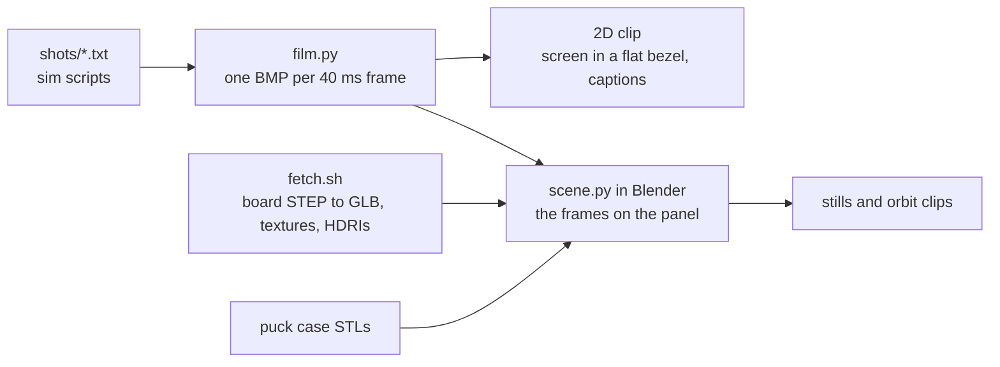

# Promo renders

Images and clips of Porthole for posts and the README. Two pipelines share one source of truth, the simulator,
so every screen shown is a real frame of the real game:



The brief (audience, message, beats) is [`docs/promo/brief.md`](../../docs/promo/brief.md).

## Setup

```bash
brew install --cask blender                  # 5.1 or newer
make -C apps/porthole snap                   # the headless simulator
tools/promo/fetch.sh                         # into build/promo/assets (git-ignored)
```

`fetch.sh` downloads Waveshare's STEP for the ESP32-S3-Touch-LCD-2.1 and converts it to GLB with its part colours
(`step2glb.py`, OpenCascade through `uv`), plus CC0 textures and HDRIs from Poly Haven. None of it is committed.

The case comes from the puck case STLs (`hardware/case/stl/puck_*.stl` on the `feat/puck-case` branch); pass
their folder as `--stl`.

## Frames from the simulator

```bash
python3 tools/promo/film.py tools/promo/shots/timelapse.txt              # raw frames only
python3 tools/promo/film.py tools/promo/shots/fetch.txt fetch.mp4        # plus the 2D clip
python3 tools/promo/film.py tools/promo/shots/biscuit.txt biscuit.mp4 hires
```

A shot is the simulator's script grammar (see the `tour` skill) plus `rec on|off`, `caption TEXT` and
`repeat N` ... `end`. Raw frames land in `apps/porthole/build/host/film/<shot>/`.

## Blender

```bash
STL=path/to/hardware/case/stl
FR=apps/porthole/build/host/film
blender -b -P tools/promo/scene.py -- --stl $STL --frames $FR/party --look walnut-night --shot hero --frame 50 --out hero.png
blender -b -P tools/promo/scene.py -- --stl $STL --frames $FR/timelapse --look oak-day --shot orbit --anim --out orbit/f####
blender -b -P tools/promo/scene.py -- --stl $STL --frames $FR/biscuit --smooth --shot orbit --anim --out biscuit/f####
```

| `--look` | Table | Case | Light |
| --- | --- | --- | --- |
| `walnut-night` | dark wood | charcoal | warm, low, firelit |
| `concrete-sage` | concrete | sage green, matte | soft studio |
| `clear-slate` | worn concrete | frosted clear PETG | crisp studio |
| `oak-day` | oak veneer | warm white | bright soft daylight |

| `--shot` | Camera |
| --- | --- |
| `hero` | high, nearly top-down: the screen readable |
| `macro` | low at the side: USB-C, the power slider, 0.2 mm layer lines |
| `orbit` | three-quarter; with `--anim`, a slow orbit and push-in over the clip |
| `exploded` | ring, board, plate and cup pulled apart |

About 10-20 s a frame on an M3 Max at 96 samples. `--from N` resumes an interrupted `--anim`. The screen is an
emissive disc textured with the frames (nearest-neighbour for Pets Club, `--smooth` for Biscuit's native art).

With Blender open, the official Blender Lab MCP (`claude mcp get blender`) lets an agent inspect and tweak the
scene live; `scene.py` stays the reproducible version.
